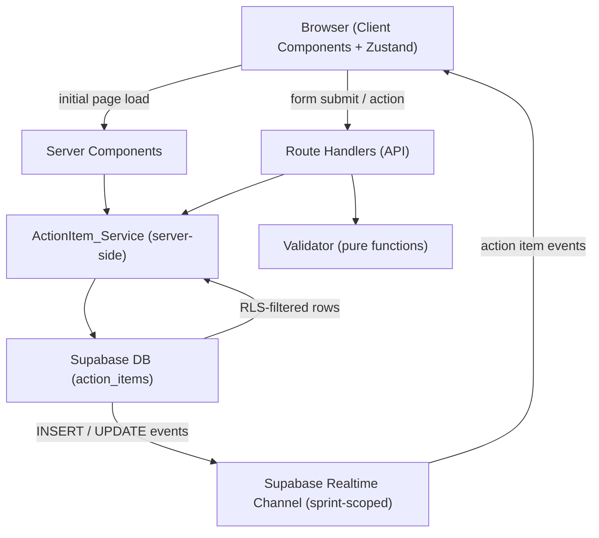

# Design Document: Action Items Tracker & History

## Overview

The Action Items Tracker & History feature is the fourth in SprintSync's implementation order. It builds directly on the Retrospective Board feature, reusing `createServerClient`, middleware, RLS patterns, the Route Handler error response shape `{ data: T }` / `{ error: E }`, and the Realtime subscription pattern established in the previous three features.

The feature delivers four interconnected surfaces:

1. **Action_Items_Panel** — a section rendered on the existing Retro_Page (`/teams/[teamId]/sprints/[sprintId]/retro`) that lists all ActionItems for the current sprint, supports creation from RetroCards or manually, and updates in real time.
2. **Dashboard_Callout** — a section rendered on the existing Dashboard_Page (`/teams/[teamId]/dashboard`) that surfaces unresolved ActionItems from the most recently completed sprint and provides a "Carry Forward" control.
3. **Action_Items_History_Page** — a new Server Component page at `/teams/[teamId]/sprints/[sprintId]/action-items` listing all ActionItems for any sprint with a summary row.
4. **ConvertCardButton** — a control rendered on each RetroCard when the board is in `discussing` or `closed` status, allowing facilitators to convert a card into an ActionItem.

All data access is centralised in a new **ActionItem_Service** layer (`lib/action-items/service.ts`), mirroring the Board_Service pattern. Validation logic lives in a companion **Validator** (`lib/action-items/validators.ts`). Both are server-side only.

### Key Design Goals

- **Consistency with existing patterns**: Reuse `createServerClient` from `lib/supabase/server.ts`, the same middleware auth guard, and the same RLS-first approach. Route Handlers return `{ data: T }` on success and `{ error: ActionItemError }` on failure with the same HTTP status code conventions.
- **Realtime-first**: A Supabase Realtime subscription scoped to `sprint_id` drives live updates on the Retro_Page — all connected clients see ActionItem insertions and status changes without a page refresh.
- **Role-based access at the service layer**: Facilitator vs. participant permissions are enforced in the ActionItem_Service in addition to RLS, mirroring the Board_Service facilitator check pattern.
- **Status lifecycle enforcement**: Only the three permitted transitions (`todo→in_progress`, `in_progress→done`, `done→in_progress`) are accepted; all others are rejected at the service layer.
- **Carry Forward is non-destructive**: Creating a carry-forward copy never modifies the original ActionItem record.

---

## Architecture

### High-Level Flow



### Next.js App Router Structure

```
app/
  teams/
    [teamId]/
      dashboard/
        page.tsx                        ← Dashboard_Page (existing — add Dashboard_Callout)
      sprints/
        [sprintId]/
          retro/
            page.tsx                    ← Retro_Page (existing — add Action_Items_Panel)
          action-items/
            page.tsx                    ← Action_Items_History_Page (Server Component)
  api/
    teams/
      [teamId]/
        sprints/
          [sprintId]/
            action-items/
              route.ts                  ← GET (list) + POST (create)
              [actionItemId]/
                route.ts                ← PATCH (update description/assignee) + DELETE
                status/
                  route.ts              ← PATCH (status transition only)
                carry-forward/
                  route.ts              ← POST (carry forward to active sprint)

lib/
  supabase/
    server.ts                           ← createServerClient (SSR) — reused
    client.ts                           ← createBrowserClient — reused
  action-items/
    service.ts                          ← ActionItem_Service
    validators.ts                       ← Validator — pure validation functions

components/
  action-items/
    ActionItemsPanel.tsx                ← Root panel Client Component (owns Realtime subscription)
    ActionItemCard.tsx                  ← Single action item row with status control
    ActionItemForm.tsx                  ← Create / edit form (Client Component)
    ActionItemStatusControl.tsx         ← Status transition dropdown/button
    ConvertCardButton.tsx               ← Button rendered on RetroCard for conversion
    DashboardCallout.tsx                ← Unresolved items callout (Client Component)
    CarryForwardButton.tsx              ← Carry forward control in DashboardCallout

types/
  action-items.ts                       ← ActionItem, ActionItemError TypeScript types
```

### Middleware

The existing `middleware.ts` already protects all routes under `(protected)/`. The new `/teams/[teamId]/sprints/[sprintId]/action-items` route is placed under the same protected layout — no middleware changes required.

---

## Components and Interfaces

### ActionItem_Service (`lib/action-items/service.ts`)

All functions are server-side only and use the Supabase server client. Every query is team-scoped via the sprint → team relationship enforced by RLS.

```typescript
// Queries
getActionItemsForSprint(sprintId: string): Promise<ActionItem[]>
getActionItemById(actionItemId: string): Promise<ActionItem | null>
getUnresolvedItemsFromLastCompletedSprint(teamId: string): Promise<UnresolvedCalloutData | null>

// Mutations
createActionItem(data: CreateActionItemData, requestingUserId: string, isFacilitator: boolean): Promise<ActionItemResult>
updateActionItem(actionItemId: string, data: UpdateActionItemData, requestingUserId: string, isFacilitator: boolean): Promise<ActionItemResult>
deleteActionItem(actionItemId: string, requestingUserId: string, isFacilitator: boolean): Promise<DeleteResult>
transitionStatus(actionItemId: string, newStatus: ActionItemStatus, requestingUserId: string): Promise<ActionItemResult>
carryForward(actionItemId: string, requestingUserId: string, isFacilitator: boolean): Promise<ActionItemResult>
```

```typescript
type CreateActionItemData = {
  sprint_id: string
  assignee_id: string
  description: string
  source_card_id: string | null   // null for manual creation
}

type UpdateActionItemData = {
  description: string
  assignee_id: string
}

type ActionItemResult = { actionItem: ActionItem } | { error: ActionItemError }
type DeleteResult     = { success: true }          | { error: ActionItemError }

type UnresolvedCalloutData = {
  sprint: { id: string; sprint_number: number }
  items: ActionItemWithAssignee[]
}
```

#### Status Transition Logic

Valid transitions are enforced in `transitionStatus`:

```typescript
const VALID_TRANSITIONS: Record<ActionItemStatus, ActionItemStatus[]> = {
  todo:        ['in_progress'],
  in_progress: ['done'],
  done:        ['in_progress'],
}
```

If the requested transition is not in the allowed list, the service returns an `ActionItemError` with code `'INVALID_STATUS_TRANSITION'`.

#### Authorization Logic

- **Create / Edit / Delete**: Only facilitators may perform these operations. If `isFacilitator` is false, the service returns `FORBIDDEN`.
- **Status transition**: Any authenticated team member may transition the status of an ActionItem assigned to them (`assignee_id === requestingUserId`). Facilitators may transition any item. All other attempts return `FORBIDDEN`.
- **Carry Forward**: Only facilitators may carry forward items. Returns `FORBIDDEN` if not a facilitator.

#### `getUnresolvedItemsFromLastCompletedSprint`

Fetches the single most recently completed sprint for the team (ordered by `sprint_number` descending, `status = 'completed'`), then fetches all ActionItems for that sprint where `status IN ('todo', 'in_progress')`. Returns `null` if no completed sprint exists or all items are `done`.

#### `carryForward`

Creates a new ActionItem in the active sprint, copying `description` and `assignee_id` from the original, with `status = 'todo'` and `source_card_id = null`. The original record is never modified. Returns `NO_ACTIVE_SPRINT` error if no active sprint exists for the team.

### Validator (`lib/action-items/validators.ts`)

Pure functions — no side effects, no I/O.

```typescript
validateDescription(value: string): ValidationResult   // non-empty, at least one non-whitespace char, ≤ 500 chars
validateAssigneeId(value: string): ValidationResult    // non-empty UUID string
validateStatusTransition(current: ActionItemStatus, next: ActionItemStatus): ValidationResult

type ValidationResult = { valid: true } | { valid: false; message: string }
```

### Realtime Subscription

`ActionItemsPanel.tsx` owns the Supabase Realtime channel. A single channel is subscribed to the `action_items` table, filtered by `sprint_id`:

```typescript
const channel = supabase
  .channel(`action-items-${sprintId}`)
  .on('postgres_changes', {
    event: 'INSERT',
    schema: 'public',
    table: 'action_items',
    filter: `sprint_id=eq.${sprintId}`,
  }, (payload) => handleActionItemInsert(payload.new as ActionItem))
  .on('postgres_changes', {
    event: 'UPDATE',
    schema: 'public',
    table: 'action_items',
    filter: `sprint_id=eq.${sprintId}`,
  }, (payload) => handleActionItemUpdate(payload.new as ActionItem))
  .subscribe()

return () => { supabase.removeChannel(channel) }
```

### Route Handlers

All Route Handlers follow the same pattern: authenticate via `createServerClient`, verify team membership, validate input, call ActionItem_Service, return `{ data: T }` or `{ error: ActionItemError }`.

| Method | Path | Action |
|---|---|---|
| `GET` | `/api/teams/[teamId]/sprints/[sprintId]/action-items` | List ActionItems for sprint |
| `POST` | `/api/teams/[teamId]/sprints/[sprintId]/action-items` | Create ActionItem |
| `PATCH` | `/api/teams/[teamId]/sprints/[sprintId]/action-items/[actionItemId]` | Edit description/assignee (facilitator only) |
| `DELETE` | `/api/teams/[teamId]/sprints/[sprintId]/action-items/[actionItemId]` | Delete ActionItem (facilitator only) |
| `PATCH` | `/api/teams/[teamId]/sprints/[sprintId]/action-items/[actionItemId]/status` | Transition status |
| `POST` | `/api/teams/[teamId]/sprints/[sprintId]/action-items/[actionItemId]/carry-forward` | Carry forward to active sprint |

### Page and Panel Components

| Component | Type | Responsibility |
|---|---|---|
| `Action_Items_History_Page` (`page.tsx`) | Server Component | Fetches all ActionItems for the sprint server-side; calls `notFound()` if sprint does not belong to team; renders summary row and item list |
| `ActionItemsPanel` | Client Component | Owns Realtime subscription; renders list of `ActionItemCard` components; renders "Add Action Item" button for facilitators; handles insert/update events |
| `ActionItemCard` | Client Component | Renders description, assignee display name, status; renders `ActionItemStatusControl` for assignee or facilitator; renders Edit/Delete controls for facilitators |
| `ActionItemForm` | Client Component | Controlled form for create/edit; description textarea (max 500 chars); assignee selector (team members); client-side validation; POST/PATCH to Route Handler; field-level errors; retains data on error |
| `ActionItemStatusControl` | Client Component | Renders next-status button(s) based on current status and VALID_TRANSITIONS; PATCH to status Route Handler; shows toast on success; reverts on error |
| `ConvertCardButton` | Client Component | Rendered on `RetroCard` when board status is `discussing` or `closed` and user is facilitator; disabled with visual indicator when card already converted; opens `ActionItemForm` pre-populated with card content |
| `DashboardCallout` | Client Component | Renders unresolved items from last completed sprint; renders `CarryForwardButton` per item for facilitators; navigates to Action_Items_History_Page on item click |
| `CarryForwardButton` | Client Component | POST to carry-forward Route Handler; shows visual indicator on success; shows error message if no active sprint |

---

## Data Models

### `action_items` Table

```sql
CREATE TABLE action_items (
  id             uuid PRIMARY KEY DEFAULT gen_random_uuid(),
  sprint_id      uuid NOT NULL REFERENCES sprints(id) ON DELETE CASCADE,
  assignee_id    uuid NOT NULL REFERENCES auth.users(id) ON DELETE RESTRICT,
  description    text NOT NULL CHECK (char_length(description) BETWEEN 1 AND 500),
  status         text NOT NULL DEFAULT 'todo'
                   CHECK (status IN ('todo', 'in_progress', 'done')),
  source_card_id uuid REFERENCES retro_cards(id) ON DELETE SET NULL,
  created_at     timestamptz NOT NULL DEFAULT now()
);
```

### RLS Policies

Team membership is determined via the `team_members` table. The join path is: `action_items → sprints → teams → team_members`.

```sql
-- Enable RLS
ALTER TABLE action_items ENABLE ROW LEVEL SECURITY;

-- SELECT: team members can read action items for their team's sprints
CREATE POLICY "action_items_select_team_member"
  ON action_items FOR SELECT
  USING (
    sprint_id IN (
      SELECT s.id FROM sprints s
      JOIN team_members tm ON tm.team_id = s.team_id
      WHERE tm.user_id = auth.uid()
    )
  );

-- INSERT: team members can insert action items for their team's sprints
-- (facilitator check is enforced at the service layer)
CREATE POLICY "action_items_insert_team_member"
  ON action_items FOR INSERT
  WITH CHECK (
    sprint_id IN (
      SELECT s.id FROM sprints s
      JOIN team_members tm ON tm.team_id = s.team_id
      WHERE tm.user_id = auth.uid()
    )
  );

-- UPDATE: team members can update action items for their team's sprints
-- (assignee-only status update and facilitator-only edit are enforced at the service layer)
CREATE POLICY "action_items_update_team_member"
  ON action_items FOR UPDATE
  USING (
    sprint_id IN (
      SELECT s.id FROM sprints s
      JOIN team_members tm ON tm.team_id = s.team_id
      WHERE tm.user_id = auth.uid()
    )
  )
  WITH CHECK (
    sprint_id IN (
      SELECT s.id FROM sprints s
      JOIN team_members tm ON tm.team_id = s.team_id
      WHERE tm.user_id = auth.uid()
    )
  );

-- DELETE: team members can delete action items for their team's sprints
-- (facilitator check is enforced at the service layer)
CREATE POLICY "action_items_delete_team_member"
  ON action_items FOR DELETE
  USING (
    sprint_id IN (
      SELECT s.id FROM sprints s
      JOIN team_members tm ON tm.team_id = s.team_id
      WHERE tm.user_id = auth.uid()
    )
  );
```

### TypeScript Types (`types/action-items.ts`)

```typescript
export type ActionItemStatus = 'todo' | 'in_progress' | 'done'

export interface ActionItem {
  id: string
  sprint_id: string
  assignee_id: string
  description: string
  status: ActionItemStatus
  source_card_id: string | null
  created_at: string
}

export interface ActionItemWithAssignee extends ActionItem {
  assignee: {
    id: string
    display_name: string
  }
}

export interface ActionItemError {
  code: ActionItemErrorCode
  message: string
  field?: 'description' | 'assignee_id'
}

export type ActionItemErrorCode =
  | 'DESCRIPTION_REQUIRED'
  | 'DESCRIPTION_TOO_LONG'
  | 'ASSIGNEE_REQUIRED'
  | 'ASSIGNEE_INVALID'
  | 'INVALID_STATUS_TRANSITION'
  | 'ACTION_ITEM_NOT_FOUND'
  | 'NO_ACTIVE_SPRINT'
  | 'SPRINT_NOT_FOUND'
  | 'SPRINT_UNAUTHORIZED'
  | 'UNAUTHORIZED'
  | 'FORBIDDEN'
  | 'UNKNOWN'

export type CreateActionItemData = {
  sprint_id: string
  assignee_id: string
  description: string
  source_card_id: string | null
}

export type UpdateActionItemData = {
  description: string
  assignee_id: string
}

export type ActionItemResult = { actionItem: ActionItem } | { error: ActionItemError }
export type DeleteResult     = { success: true }          | { error: ActionItemError }
```

---

## Correctness Properties

*A property is a characteristic or behavior that should hold true across all valid executions of a system — essentially, a formal statement about what the system should do. Properties serve as the bridge between human-readable specifications and machine-verifiable correctness guarantees.*

### Property 1: Action item creation round-trip preserves all provided fields

*For any* valid `CreateActionItemData` (non-empty description ≤ 500 chars, valid `assignee_id`, valid `sprint_id`, and any value of `source_card_id` including null), a successful `createActionItem` call must persist an `ActionItem` record whose `description`, `assignee_id`, `sprint_id`, and `source_card_id` exactly match the provided values, and whose `status` is `'todo'`.

**Validates: Requirements 1.3, 1.4, 2.3**

---

### Property 2: Description validator correctly classifies values

*For any* string that is empty, composed entirely of whitespace, or exceeds 500 characters, `validateDescription` must return `valid: false` with a non-empty message. *For any* non-empty string of at most 500 characters containing at least one non-whitespace character, `validateDescription` must return `valid: true`.

**Validates: Requirements 2.4**

---

### Property 3: Assignee ID validator correctly classifies values

*For any* string that is empty or not a valid UUID format, `validateAssigneeId` must return `valid: false` with a non-empty message. *For any* non-empty UUID string, `validateAssigneeId` must return `valid: true`.

**Validates: Requirements 2.5**

---

### Property 4: Action items are ordered by creation time ascending

*For any* set of `ActionItem` objects with varying `created_at` timestamps linked to the same `sprint_id`, `getActionItemsForSprint` must return them ordered by `created_at` ascending — the earliest-created item appears first.

**Validates: Requirements 3.1, 7.1**

---

### Property 5: Action item rendering contains all required fields

*For any* `ActionItemWithAssignee` object with any valid field values, the rendered `ActionItemCard` must contain the item's `description`, the assignee's `display_name`, and the `status`. The rendered `Action_Items_History_Page` row must additionally contain the `created_at` timestamp.

**Validates: Requirements 3.2, 6.2, 7.2**

---

### Property 6: Realtime event handlers correctly update local state

*For any* `ActionItem` delivered via a Realtime INSERT event, calling `handleActionItemInsert` must add the item to the panel's list. *For any* `ActionItem` delivered via a Realtime UPDATE event, calling `handleActionItemUpdate` must replace the existing item with the same `id` in the panel's list, reflecting the new field values.

**Validates: Requirements 3.5, 4.4**

---

### Property 7: Status transition state machine enforces valid transitions only

*For any* `ActionItem` in any `status`, `transitionStatus` must succeed only for the three valid transitions (`todo→in_progress`, `in_progress→done`, `done→in_progress`). Any attempt to transition to any other status — including backwards transitions not in the allowed set, or any transition from `done` other than back to `in_progress` — must return an `ActionItemError` with code `'INVALID_STATUS_TRANSITION'`.

**Validates: Requirements 4.2**

---

### Property 8: Status transition round-trip persists the new status

*For any* `ActionItem` and any valid next status (per the transition rules), a successful `transitionStatus` call must result in the `ActionItem` record in the database having `status` equal to the requested new status.

**Validates: Requirements 4.3**

---

### Property 9: Edit/Delete controls are visible only to facilitators

*For any* `ActionItem` and any user role state, the Edit and Delete controls rendered in `ActionItemCard` must be visible when and only when the authenticated user is a facilitator. Non-facilitator users must never see these controls regardless of the item's content or status.

**Validates: Requirements 5.1**

---

### Property 10: Action item update round-trip preserves all provided fields

*For any* valid `UpdateActionItemData` (non-empty description ≤ 500 chars, valid `assignee_id`) submitted for an existing `ActionItem`, a successful `updateActionItem` call must persist an `ActionItem` record whose `description` and `assignee_id` exactly match the provided values.

**Validates: Requirements 5.3**

---

### Property 11: Dashboard callout surfaces only unresolved items from the most recently completed sprint

*For any* team state with one or more completed sprints, `getUnresolvedItemsFromLastCompletedSprint` must return only `ActionItem` records whose `status` is `'todo'` or `'in_progress'`, and only those belonging to the sprint with the highest `sprint_number` among all completed sprints for the team. If all items in the most recently completed sprint have `status = 'done'`, or if no completed sprint exists, the function must return `null`.

**Validates: Requirements 6.1, 6.3, 6.4, 6.5**

---

### Property 12: Action items history summary row is correct

*For any* list of `ActionItem` objects with varying `status` values, the summary row rendered on the `Action_Items_History_Page` must display a total count equal to the length of the list and a done count equal to the number of items with `status = 'done'`.

**Validates: Requirements 7.3**

---

### Property 13: Cross-team sprint access is rejected

*For any* `sprintId` that does not belong to a sprint associated with the authenticated user's team, `getActionItemsForSprint` must return an empty result (due to RLS), causing the `Action_Items_History_Page` to call `notFound()` and return a 404 response.

**Validates: Requirements 7.4, 9.1, 9.6**

---

### Property 14: Carry forward creates a correct copy and leaves the original unchanged

*For any* `ActionItem` with any `status` in `{'todo', 'in_progress'}`, a successful `carryForward` call must create a new `ActionItem` record in the active sprint whose `description` and `assignee_id` match the original, whose `status` is `'todo'`, and whose `source_card_id` is `null`. The original `ActionItem` record must remain unchanged — its `description`, `assignee_id`, `status`, `sprint_id`, and `source_card_id` must be identical before and after the call.

**Validates: Requirements 8.2, 8.3**

---

### Property 15: Carry forward control is visible only to facilitators

*For any* unresolved `ActionItem` in the `Dashboard_Callout` and any user role state, the `CarryForwardButton` must be rendered when and only when the authenticated user is a facilitator.

**Validates: Requirements 8.1**

---

### Property 16: Non-facilitator create/edit/delete is rejected

*For any* create, update, or delete request submitted with `isFacilitator = false`, the `ActionItem_Service` must return an `ActionItemError` with code `'FORBIDDEN'` — no record must be created, modified, or deleted.

**Validates: Requirements 9.2**

---

### Property 17: Non-assignee status update is rejected

*For any* status transition request where `requestingUserId` does not match the `ActionItem`'s `assignee_id` and `isFacilitator` is `false`, `transitionStatus` must return an `ActionItemError` with code `'FORBIDDEN'` — the `ActionItem`'s status must remain unchanged.

**Validates: Requirements 9.3**

---

### Property 18: ConvertCardButton visibility matches board status

*For any* `RetroBoard` with `status` in `{'collecting', 'grouping', 'voting'}`, the `ConvertCardButton` must not be rendered on any `RetroCard`. *For any* `RetroBoard` with `status` in `{'discussing', 'closed'}`, the `ConvertCardButton` must be rendered on each visible `RetroCard` for facilitator users.

**Validates: Requirements 1.1**

---

## Error Handling

### Error Classification

| Category | Examples | Handling |
|---|---|---|
| Validation errors | Empty description, description > 500 chars, missing assignee_id | Field-level error message inline beneath the relevant input; form retains entered data |
| Business rule errors | Invalid status transition, no active sprint for carry forward | Inline error message on the relevant control; control reverts to previous state |
| Authorization errors | Non-facilitator create/edit/delete, non-assignee status update | `FORBIDDEN` error returned from service; UI displays descriptive message |
| Not found errors | sprintId not belonging to user's team | 404 response from Server Component via `notFound()` |
| Network / service errors | Supabase unreachable, unexpected DB error | Toast notification with retry suggestion; form retains data |

### Error Message Strategy

- **Field-level errors**: Displayed inline beneath the relevant input, associated via `aria-describedby`. Cleared when the user modifies the relevant field.
- **Authorization errors**: Display "You don't have permission to perform this action." — never expose internal role-check details.
- **No active sprint**: Display "An active sprint is required to carry forward items." in the `DashboardCallout`.
- **Status revert**: When a status update fails, the `ActionItemStatusControl` reverts to the previous status value and shows an inline error.
- **Not found / wrong team**: Server Component calls `notFound()` — no information leakage about whether the sprint exists for another team.
- **Unexpected errors** (code `UNKNOWN`): Display "Something went wrong. Please try again." — never expose raw Supabase error messages to the client.

### Route Handler Error Responses

```typescript
// Success
{ data: T }

// Error
{ error: { code: ActionItemErrorCode; message: string; field?: string } }
```

HTTP status codes:
- `400` — validation failure or business rule violation (invalid status transition)
- `401` — unauthenticated
- `403` — authenticated but not a member of the target team, or insufficient role
- `404` — sprint or action item not found or not belonging to user's team
- `409` — conflict (e.g., no active sprint for carry forward)
- `500` — unexpected server error

---

## Testing Strategy

### Unit Tests (Vitest)

Focus on the Validator pure functions and ActionItem_Service logic with mocked Supabase clients:

- **Validator**: Test each validation function with representative valid inputs, invalid inputs, and boundary values (empty string, whitespace-only, exactly 500 chars, 501 chars, empty UUID, valid UUID).
- **ActionItem_Service**: Test status transition logic — all valid transitions succeed, all invalid transitions return `INVALID_STATUS_TRANSITION`. Test authorization checks — non-facilitator create/edit/delete returns `FORBIDDEN`, non-assignee status update returns `FORBIDDEN`.
- **`getUnresolvedItemsFromLastCompletedSprint`**: Test with teams having no completed sprints, all-done items, and mixed-status items across multiple completed sprints.
- **`carryForward`**: Test that original record is unchanged and new record has correct fields; test `NO_ACTIVE_SPRINT` error when no active sprint exists.

### Property-Based Tests (fast-check)

Use [fast-check](https://github.com/dubzzz/fast-check) for Validator functions and ActionItem_Service logic. Each property test runs a minimum of 100 iterations.

**Property 1 — Action item creation round-trip preserves all provided fields**
Tag: `Feature: action-items-tracker, Property 1: Action item creation round-trip preserves all provided fields`
Generate: valid `CreateActionItemData` with varying descriptions (1–500 chars), UUIDs for assignee_id and sprint_id, and both null and non-null source_card_id; assert `createActionItem` (mocked Supabase) is called with matching fields and status='todo'.

**Property 2 — Description validator correctly classifies values**
Tag: `Feature: action-items-tracker, Property 2: Description validator correctly classifies values`
Generate: empty strings, whitespace-only strings (spaces/tabs/newlines), strings of 501+ chars; assert `validateDescription` returns `valid: false`. Generate non-empty strings of 1–500 chars with at least one non-whitespace char; assert `valid: true`.

**Property 3 — Assignee ID validator correctly classifies values**
Tag: `Feature: action-items-tracker, Property 3: Assignee ID validator correctly classifies values`
Generate: empty strings, non-UUID strings (arbitrary alphanumeric, partial UUIDs); assert `validateAssigneeId` returns `valid: false`. Generate valid UUID v4 strings; assert `valid: true`.

**Property 4 — Action items are ordered by creation time ascending**
Tag: `Feature: action-items-tracker, Property 4: Action items are ordered by creation time ascending`
Generate: arrays of `ActionItem` objects with random `created_at` timestamps; assert `getActionItemsForSprint` (mocked DB) returns them sorted by `created_at` ascending.

**Property 5 — Action item rendering contains all required fields**
Tag: `Feature: action-items-tracker, Property 5: Action item rendering contains all required fields`
Generate: random `ActionItemWithAssignee` objects with varying descriptions, assignee display names, statuses, and created_at values; assert rendered `ActionItemCard` output contains description, assignee display name, and status; assert rendered history page row additionally contains created_at.

**Property 6 — Realtime event handlers correctly update local state**
Tag: `Feature: action-items-tracker, Property 6: Realtime event handlers correctly update local state`
Generate: random `ActionItem` objects for INSERT events; assert item is added to the list. Generate random `ActionItem` objects for UPDATE events (matching an existing item's id); assert the existing item is replaced with the updated values.

**Property 7 — Status transition state machine enforces valid transitions only**
Tag: `Feature: action-items-tracker, Property 7: Status transition state machine enforces valid transitions only`
Generate: all combinations of `(current_status, attempted_next_status)` from the three valid status values; assert `transitionStatus` succeeds only for the three valid pairs (`todo→in_progress`, `in_progress→done`, `done→in_progress`) and returns `INVALID_STATUS_TRANSITION` for all other combinations.

**Property 8 — Status transition round-trip persists the new status**
Tag: `Feature: action-items-tracker, Property 8: Status transition round-trip persists the new status`
Generate: `ActionItem` objects in each status paired with their valid next status; assert `transitionStatus` (mocked Supabase) updates the record with the new status value.

**Property 9 — Edit/Delete controls are visible only to facilitators**
Tag: `Feature: action-items-tracker, Property 9: Edit/Delete controls are visible only to facilitators`
Generate: random `ActionItem` objects and boolean `isFacilitator` values; assert Edit and Delete controls are rendered when `isFacilitator = true` and not rendered when `isFacilitator = false`.

**Property 10 — Action item update round-trip preserves all provided fields**
Tag: `Feature: action-items-tracker, Property 10: Action item update round-trip preserves all provided fields`
Generate: valid `UpdateActionItemData` (non-empty description ≤ 500 chars, valid UUID assignee_id); assert `updateActionItem` (mocked Supabase) is called with matching field values.

**Property 11 — Dashboard callout surfaces only unresolved items from the most recently completed sprint**
Tag: `Feature: action-items-tracker, Property 11: Dashboard callout surfaces only unresolved items from the most recently completed sprint`
Generate: team states with varying numbers of completed sprints (including zero), each with ActionItems of varying statuses; assert `getUnresolvedItemsFromLastCompletedSprint` returns only `todo`/`in_progress` items from the sprint with the highest `sprint_number`, and returns `null` when all items are `done` or no completed sprint exists.

**Property 12 — Action items history summary row is correct**
Tag: `Feature: action-items-tracker, Property 12: Action items history summary row is correct`
Generate: lists of `ActionItem` objects with varying status distributions; assert the summary row displays total count equal to list length and done count equal to the number of items with `status = 'done'`.

**Property 13 — Cross-team sprint access is rejected**
Tag: `Feature: action-items-tracker, Property 13: Cross-team sprint access is rejected`
Generate: `sprintId`/`teamId` pairs where the sprint belongs to a different team (mocked DB returns no rows due to RLS); assert `getActionItemsForSprint` returns an empty array, causing the history page to call `notFound()`.

**Property 14 — Carry forward creates a correct copy and leaves the original unchanged**
Tag: `Feature: action-items-tracker, Property 14: Carry forward creates a correct copy and leaves the original unchanged`
Generate: `ActionItem` objects with varying descriptions, assignee_ids, and statuses; assert `carryForward` (mocked Supabase) creates a new record with matching description/assignee_id, status='todo', source_card_id=null, and the active sprint's sprint_id; assert the original record's fields are not modified.

**Property 15 — Carry forward control is visible only to facilitators**
Tag: `Feature: action-items-tracker, Property 15: Carry forward control is visible only to facilitators`
Generate: random unresolved `ActionItem` objects and boolean `isFacilitator` values; assert `CarryForwardButton` is rendered when `isFacilitator = true` and not rendered when `isFacilitator = false`.

**Property 16 — Non-facilitator create/edit/delete is rejected**
Tag: `Feature: action-items-tracker, Property 16: Non-facilitator create/edit/delete is rejected`
Generate: create, update, and delete requests with `isFacilitator = false`; assert `ActionItem_Service` returns `ActionItemError` with code `'FORBIDDEN'` for all three operations.

**Property 17 — Non-assignee status update is rejected**
Tag: `Feature: action-items-tracker, Property 17: Non-assignee status update is rejected`
Generate: `ActionItem` objects and `requestingUserId` values that do not match `assignee_id`, with `isFacilitator = false`; assert `transitionStatus` returns `ActionItemError` with code `'FORBIDDEN'`.

**Property 18 — ConvertCardButton visibility matches board status**
Tag: `Feature: action-items-tracker, Property 18: ConvertCardButton visibility matches board status`
Generate: `RetroBoard` objects with each valid status value; assert `ConvertCardButton` is rendered on `RetroCard` components when and only when board status is `'discussing'` or `'closed'` and the user is a facilitator.

### Integration Tests

- **Action item creation flow**: POST to Route Handler with valid data; verify `action_items` record created with correct fields and `status='todo'`.
- **Card conversion flow**: POST with `source_card_id` set; verify `source_card_id` is persisted on the new record.
- **Status transition flow**: PATCH to status Route Handler with valid transition; verify `status` updated in DB.
- **Invalid status transition**: PATCH with invalid transition; verify 400 response with `INVALID_STATUS_TRANSITION` code.
- **Non-facilitator create rejected**: POST as non-facilitator; verify 403 response.
- **Non-assignee status update rejected**: PATCH status as non-assignee non-facilitator; verify 403 response.
- **Edit flow**: PATCH to action item Route Handler with valid data; verify `description` and `assignee_id` updated in DB.
- **Delete flow**: DELETE to action item Route Handler; verify record removed from DB.
- **Carry forward flow**: POST to carry-forward Route Handler; verify new record created in active sprint with correct fields; verify original record unchanged.
- **Carry forward — no active sprint**: POST carry-forward when no active sprint exists; verify 409 response with `NO_ACTIVE_SPRINT` code.
- **Dashboard callout scoping**: Verify `getUnresolvedItemsFromLastCompletedSprint` returns only items from the most recently completed sprint.
- **RLS enforcement**: Attempt to read/write `action_items` for a team the user doesn't belong to; verify access is denied.
- **Cross-team 404**: Navigate to `sprintId` belonging to another team; verify 404 response.
- **Realtime subscription**: Insert an action item and verify the subscription callback fires with the new item data.

### Smoke Tests

- `action_items` table exists with correct schema, constraints (`status CHECK`, `char_length(description) BETWEEN 1 AND 500`), foreign keys, and RLS policies.
- Supabase Realtime is enabled for the `action_items` table.
- Unauthenticated requests to the Retro_Page and Action_Items_History_Page are redirected to `/auth` by middleware.
- `Action_Items_History_Page` is a Server Component using the Supabase server client.
- `Dashboard_Page` fetches `Dashboard_Callout` data using the Supabase server client in a Server Component.
