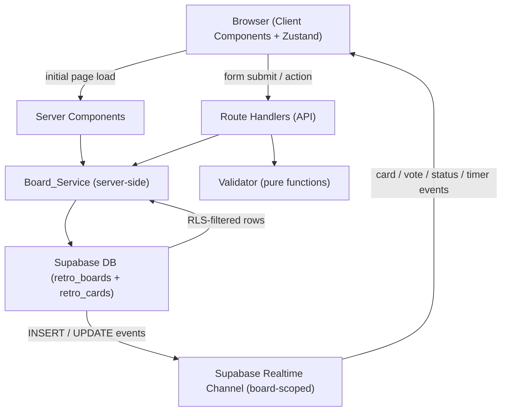

# Design Document: Real-Time Retrospective Board

## Overview

The Real-Time Retrospective Board is the third feature in SprintSync's implementation order. It builds directly on the auth, team management, and sprint foundations established by the previous two features, reusing `createServerClient`, middleware, RLS patterns, and the Route Handler error response shape from Sprint Dashboard & Review Management.

The feature delivers a single interactive surface:

- **Retro_Page** (`/teams/[teamId]/sprints/[sprintId]/retro`) — a hybrid page that loads initial board state server-side and then hands off to client-side Realtime subscriptions for live updates.

All data access is centralised in a new **Board_Service** layer (`lib/retro/service.ts`), mirroring the Sprint_Service pattern. Validation logic lives in a companion **Validator** (`lib/retro/validators.ts`). Ephemeral client-side state (optimistic card additions, local vote counts) is managed by a **Retro_Store** Zustand store (`lib/retro/store.ts`).

### Key Design Goals

- **Consistency with existing patterns**: Reuse `createServerClient` from `lib/supabase/server.ts`, the same middleware auth guard, and the same RLS-first approach. Route Handlers return `{ data: T }` on success and `{ error: RetroError }` on failure with the same HTTP status code conventions.
- **Realtime-first**: Supabase Realtime subscriptions drive all live updates — card creation, vote changes, status transitions, and timer events all flow through a single board-scoped channel.
- **Server-authoritative timer**: Timer calculations are always based on the server-persisted `timer_started_at` and `timer_duration_minutes` columns; the client only uses its local clock for rendering between sync events.
- **Card visibility enforcement at the data layer**: During the `collecting` phase, the Board_Service filters card queries so non-facilitator clients only receive their own cards.
- **Optimistic UI**: The Retro_Store applies optimistic updates for card creation and upvoting; the Realtime subscription reconciles with the confirmed database value.

---

## Architecture

### High-Level Flow



### Next.js App Router Structure

```
app/
  teams/
    [teamId]/
      sprints/
        [sprintId]/
          retro/
            page.tsx              ← Retro_Page (Server Component wrapper)
  api/
    teams/
      [teamId]/
        sprints/
          [sprintId]/
            retro/
              route.ts            ← POST /api/.../retro (create board)
              cards/
                route.ts          ← POST /api/.../retro/cards (create card)
              cards/
                [cardId]/
                  votes/
                    route.ts      ← POST /api/.../cards/[cardId]/votes (upvote)
              status/
                route.ts          ← PATCH /api/.../retro/status (transition status)
              timer/
                route.ts          ← POST/PATCH/DELETE /api/.../retro/timer (manage timer)

lib/
  supabase/
    server.ts                     ← createServerClient (SSR) — reused from feature 1
    client.ts                     ← createBrowserClient — reused from feature 1
  retro/
    service.ts                    ← Board_Service — all retro board/card mutations & queries
    validators.ts                 ← Validator — pure validation functions
    store.ts                      ← Retro_Store — Zustand store for ephemeral session state

components/
  retro/
    RetroBoard.tsx                ← Root board Client Component (owns Realtime subscription)
    RetroColumn.tsx               ← Single column (Start / Stop / Continue)
    RetroCard.tsx                 ← Individual card with optional upvote control
    CardForm.tsx                  ← Card creation form (Client Component)
    BoardStatusBadge.tsx          ← Displays current Board_Status
    StatusTransitionButton.tsx    ← Facilitator-only phase advance button
    CountdownDisplay.tsx          ← MM:SS timer display
    TimerControls.tsx             ← Facilitator-only timer cancel/extend controls

types/
  retro.ts                        ← RetroBoard, RetroCard, RetroError TypeScript types
```

### Middleware

The existing `middleware.ts` already protects all routes under `(protected)/`. The `/teams/[teamId]/sprints/[sprintId]/retro` route is placed under the same protected layout — no middleware changes required.

---

## Components and Interfaces

### Board_Service (`lib/retro/service.ts`)

All functions are server-side only and use the Supabase server client. Every query is team-scoped via the sprint → team relationship enforced by RLS.

```typescript
// Board queries and creation
getBoardForSprint(sprintId: string): Promise<RetroBoard | null>
createBoard(sprintId: string, data: CreateBoardData): Promise<BoardResult>

// Card queries (visibility-aware)
getCardsForBoard(boardId: string, requestingUserId: string, isFacilitator: boolean): Promise<RetroCard[]>

// Card creation
createCard(boardId: string, data: CreateCardData, authorId: string | null): Promise<CardResult>

// Upvoting
upvoteCard(cardId: string, boardId: string): Promise<CardResult>

// Status transitions
transitionBoardStatus(boardId: string, requestingUserId: string): Promise<BoardResult>

// Timer management
startTimer(boardId: string, durationMinutes: number): Promise<BoardResult>
cancelTimer(boardId: string): Promise<BoardResult>
extendTimer(boardId: string, additionalMinutes: number): Promise<BoardResult>
recordTimerExpiry(boardId: string): Promise<BoardResult>
```

```typescript
type CreateBoardData = {
  timer_duration_minutes?: number   // optional, 1–120
}

type CreateCardData = {
  content: string          // 1–500 characters
  category: RetroCategory  // 'Start' | 'Stop' | 'Continue'
  anonymous: boolean
}

type BoardResult = { board: RetroBoard } | { error: RetroError }
type CardResult  = { card: RetroCard }  | { error: RetroError }
```

#### Card Visibility Logic

During the `collecting` phase, `getCardsForBoard` applies an additional filter:

```typescript
// Non-facilitator: only own cards
if (board.status === 'collecting' && !isFacilitator) {
  query = query.eq('author_id', requestingUserId)
}
// Facilitator: all cards (no additional filter)
```

This is enforced at the service layer in addition to RLS, which already scopes access to the team.

#### Status Transition Logic

Valid transitions are enforced in `transitionBoardStatus`:

```typescript
const TRANSITIONS: Record<BoardStatus, BoardStatus | null> = {
  collecting: 'grouping',
  grouping:   'voting',
  voting:     'discussing',
  discussing: 'closed',
  closed:     null,
}
```

If the current status has no valid next status (`closed`) or the requesting user is not the facilitator, the service returns a `RetroError`.

#### Upvote Atomicity

`upvoteCard` uses a Postgres RPC function to atomically increment the vote count, preventing lost updates under concurrent voting:

```sql
CREATE OR REPLACE FUNCTION increment_card_votes(p_card_id uuid)
RETURNS retro_cards AS $$
DECLARE
  updated_card retro_cards;
BEGIN
  UPDATE retro_cards
  SET votes = votes + 1
  WHERE id = p_card_id
  RETURNING * INTO updated_card;

  IF NOT FOUND THEN
    RAISE EXCEPTION 'CARD_NOT_FOUND';
  END IF;

  RETURN updated_card;
END;
$$ LANGUAGE plpgsql SECURITY DEFINER;
```

### Validator (`lib/retro/validators.ts`)

Pure functions — no side effects, no I/O.

```typescript
validateContent(value: string): ValidationResult          // non-empty, ≤ 500 chars
validateCategory(value: string): ValidationResult         // 'Start' | 'Stop' | 'Continue'
validateTimerDuration(value: number): ValidationResult    // positive integer, 1–120
validateTimerExtension(currentRemainingMinutes: number, additionalMinutes: number): ValidationResult  // total ≤ 120

type ValidationResult = { valid: true } | { valid: false; message: string }
```

### Retro_Store (`lib/retro/store.ts`)

Zustand store for ephemeral client-side state. Initialised with server-fetched data and updated by both optimistic mutations and Realtime events.

```typescript
interface RetroState {
  board: RetroBoard | null
  cards: Record<RetroCategory, RetroCard[]>  // keyed by category
  timerExpiresAt: Date | null                // derived from board timer fields

  // Optimistic mutations
  optimisticAddCard(card: RetroCard): void
  optimisticIncrementVote(cardId: string): void

  // Realtime reconciliation
  handleCardInsert(card: RetroCard): void
  handleCardUpdate(card: RetroCard): void
  handleBoardUpdate(board: RetroBoard): void

  // Initialisation
  initialise(board: RetroBoard, cards: RetroCard[]): void
}
```

### Realtime Subscription

`RetroBoard.tsx` owns the Supabase Realtime channel. A single channel is subscribed to both `retro_boards` and `retro_cards` tables, filtered by `board_id`:

```typescript
const channel = supabase
  .channel(`retro-board-${boardId}`)
  .on('postgres_changes', {
    event: 'INSERT',
    schema: 'public',
    table: 'retro_cards',
    filter: `board_id=eq.${boardId}`,
  }, (payload) => store.handleCardInsert(payload.new as RetroCard))
  .on('postgres_changes', {
    event: 'UPDATE',
    schema: 'public',
    table: 'retro_cards',
    filter: `board_id=eq.${boardId}`,
  }, (payload) => store.handleCardUpdate(payload.new as RetroCard))
  .on('postgres_changes', {
    event: 'UPDATE',
    schema: 'public',
    table: 'retro_boards',
    filter: `id=eq.${boardId}`,
  }, (payload) => store.handleBoardUpdate(payload.new as RetroBoard))
  .subscribe()

// Cleanup on unmount
return () => { supabase.removeChannel(channel) }
```

Timer events (start, cancel, extend, expiry) are delivered via the `retro_boards` UPDATE event — the `timer_started_at`, `timer_duration_minutes`, and `timer_expired_at` columns change, and `handleBoardUpdate` recomputes `timerExpiresAt` in the store.

### Route Handlers

All Route Handlers follow the same pattern as Sprint Dashboard: authenticate via `createServerClient`, verify team membership, validate input, call Board_Service, return `{ data: T }` or `{ error: RetroError }`.

| Method | Path | Action |
|---|---|---|
| `POST` | `/api/teams/[teamId]/sprints/[sprintId]/retro` | Create RetroBoard |
| `POST` | `/api/teams/[teamId]/sprints/[sprintId]/retro/cards` | Create RetroCard |
| `POST` | `/api/teams/[teamId]/sprints/[sprintId]/retro/cards/[cardId]/votes` | Upvote card |
| `PATCH` | `/api/teams/[teamId]/sprints/[sprintId]/retro/status` | Transition board status |
| `POST` | `/api/teams/[teamId]/sprints/[sprintId]/retro/timer` | Start timer |
| `PATCH` | `/api/teams/[teamId]/sprints/[sprintId]/retro/timer` | Extend timer |
| `DELETE` | `/api/teams/[teamId]/sprints/[sprintId]/retro/timer` | Cancel timer |

### Page Components

| Component | Type | Responsibility |
|---|---|---|
| `Retro_Page` (`page.tsx`) | Server Component | Fetches board + cards server-side; redirects to `/auth` if unauthenticated; renders `RetroBoard` with initial data |
| `RetroBoard` | Client Component | Owns Realtime subscription; initialises Retro_Store; renders columns, status badge, facilitator controls, and timer |
| `RetroColumn` | Client Component | Renders cards for one category; renders `CardForm` when card creation is permitted |
| `RetroCard` | Client Component | Renders card content, author attribution, vote count, and upvote button |
| `CardForm` | Client Component | Controlled form with content textarea, category selector, and anonymity toggle |
| `BoardStatusBadge` | Client Component | Displays current `Board_Status` with phase label |
| `StatusTransitionButton` | Client Component | Facilitator-only; advances board to next phase |
| `CountdownDisplay` | Client Component | Renders remaining time in `MM:SS`; derives remaining time from `timerExpiresAt` in store |
| `TimerControls` | Client Component | Facilitator-only; cancel and extend timer actions |

---

## Data Models

### `retro_boards` Table

```sql
CREATE TABLE retro_boards (
  id                     uuid PRIMARY KEY DEFAULT gen_random_uuid(),
  sprint_id              uuid NOT NULL REFERENCES sprints(id) ON DELETE CASCADE,
  status                 text NOT NULL DEFAULT 'collecting'
                           CHECK (status IN ('collecting', 'grouping', 'voting', 'discussing', 'closed')),
  facilitator_id         uuid NOT NULL REFERENCES auth.users(id),
  timer_duration_minutes integer CHECK (timer_duration_minutes BETWEEN 1 AND 120),
  timer_started_at       timestamptz,
  timer_expired_at       timestamptz,
  created_at             timestamptz NOT NULL DEFAULT now(),

  UNIQUE (sprint_id)   -- one board per sprint
);
```

### `retro_cards` Table

```sql
CREATE TABLE retro_cards (
  id         uuid PRIMARY KEY DEFAULT gen_random_uuid(),
  board_id   uuid NOT NULL REFERENCES retro_boards(id) ON DELETE CASCADE,
  author_id  uuid REFERENCES auth.users(id) ON DELETE SET NULL,
  category   text NOT NULL CHECK (category IN ('Start', 'Stop', 'Continue')),
  content    text NOT NULL CHECK (char_length(content) BETWEEN 1 AND 500),
  votes      integer NOT NULL DEFAULT 0 CHECK (votes >= 0),
  created_at timestamptz NOT NULL DEFAULT now()
);
```

### RLS Policies

Team membership is determined via the `team_members` table (established in feature 1). The join path is: `retro_cards → retro_boards → sprints → teams → team_members`.

```sql
-- Enable RLS
ALTER TABLE retro_boards ENABLE ROW LEVEL SECURITY;
ALTER TABLE retro_cards  ENABLE ROW LEVEL SECURITY;

-- retro_boards: team members can read boards for their team's sprints
CREATE POLICY "retro_boards_select_team_member"
  ON retro_boards FOR SELECT
  USING (
    sprint_id IN (
      SELECT s.id FROM sprints s
      JOIN team_members tm ON tm.team_id = s.team_id
      WHERE tm.user_id = auth.uid()
    )
  );

-- retro_boards: team members can insert boards for their team's sprints
CREATE POLICY "retro_boards_insert_team_member"
  ON retro_boards FOR INSERT
  WITH CHECK (
    sprint_id IN (
      SELECT s.id FROM sprints s
      JOIN team_members tm ON tm.team_id = s.team_id
      WHERE tm.user_id = auth.uid()
    )
  );

-- retro_boards: team members can update boards for their team's sprints
CREATE POLICY "retro_boards_update_team_member"
  ON retro_boards FOR UPDATE
  USING (
    sprint_id IN (
      SELECT s.id FROM sprints s
      JOIN team_members tm ON tm.team_id = s.team_id
      WHERE tm.user_id = auth.uid()
    )
  )
  WITH CHECK (
    sprint_id IN (
      SELECT s.id FROM sprints s
      JOIN team_members tm ON tm.team_id = s.team_id
      WHERE tm.user_id = auth.uid()
    )
  );

-- retro_cards: team members can read cards for their team's boards
CREATE POLICY "retro_cards_select_team_member"
  ON retro_cards FOR SELECT
  USING (
    board_id IN (
      SELECT rb.id FROM retro_boards rb
      JOIN sprints s ON s.id = rb.sprint_id
      JOIN team_members tm ON tm.team_id = s.team_id
      WHERE tm.user_id = auth.uid()
    )
  );

-- retro_cards: team members can insert cards for their team's boards
CREATE POLICY "retro_cards_insert_team_member"
  ON retro_cards FOR INSERT
  WITH CHECK (
    board_id IN (
      SELECT rb.id FROM retro_boards rb
      JOIN sprints s ON s.id = rb.sprint_id
      JOIN team_members tm ON tm.team_id = s.team_id
      WHERE tm.user_id = auth.uid()
    )
  );

-- retro_cards: team members can update cards for their team's boards (for upvoting)
CREATE POLICY "retro_cards_update_team_member"
  ON retro_cards FOR UPDATE
  USING (
    board_id IN (
      SELECT rb.id FROM retro_boards rb
      JOIN sprints s ON s.id = rb.sprint_id
      JOIN team_members tm ON tm.team_id = s.team_id
      WHERE tm.user_id = auth.uid()
    )
  );
```

### TypeScript Types (`types/retro.ts`)

```typescript
export type BoardStatus   = 'collecting' | 'grouping' | 'voting' | 'discussing' | 'closed'
export type RetroCategory = 'Start' | 'Stop' | 'Continue'

export interface RetroBoard {
  id: string
  sprint_id: string
  status: BoardStatus
  facilitator_id: string
  timer_duration_minutes: number | null
  timer_started_at: string | null    // ISO timestamp
  timer_expired_at: string | null    // ISO timestamp
  created_at: string
}

export interface RetroCard {
  id: string
  board_id: string
  author_id: string | null           // null for anonymous cards
  category: RetroCategory
  content: string
  votes: number
  created_at: string
}

export interface RetroError {
  code: RetroErrorCode
  message: string
  field?: 'content' | 'category' | 'timer_duration_minutes'
}

export type RetroErrorCode =
  | 'BOARD_ALREADY_EXISTS'
  | 'BOARD_NOT_FOUND'
  | 'CARD_NOT_FOUND'
  | 'CONTENT_REQUIRED'
  | 'CONTENT_TOO_LONG'
  | 'CATEGORY_INVALID'
  | 'TIMER_DURATION_INVALID'
  | 'TIMER_EXTENSION_EXCEEDS_MAX'
  | 'TIMER_NOT_ACTIVE'
  | 'TIMER_EXPIRED'
  | 'CARD_CREATION_DISABLED'
  | 'INVALID_STATUS_TRANSITION'
  | 'VOTES_NEGATIVE'
  | 'UNAUTHORIZED'
  | 'FORBIDDEN'
  | 'UNKNOWN'

export type CreateBoardData = {
  timer_duration_minutes?: number
}

export type CreateCardData = {
  content: string
  category: RetroCategory
  anonymous: boolean
}

export type BoardResult = { board: RetroBoard } | { error: RetroError }
export type CardResult  = { card: RetroCard }  | { error: RetroError }
```

---

## Correctness Properties

*A property is a characteristic or behavior that should hold true across all valid executions of a system — essentially, a formal statement about what the system should do. Properties serve as the bridge between human-readable specifications and machine-verifiable correctness guarantees.*

### Property 1: Board creation round-trip preserves all provided fields

*For any* valid `sprint_id` and optional `timer_duration_minutes` (including null), a successful `createBoard` call must persist a `RetroBoard` record whose `sprint_id` matches the provided value, whose `status` is `'collecting'`, and whose `timer_duration_minutes` matches the provided value (or is null when not provided). When `timer_duration_minutes` is provided, `timer_started_at` must be set to a non-null timestamp.

**Validates: Requirements 1.3, 11.1, 11.10**

---

### Property 2: Duplicate board creation is rejected

*For any* `sprint_id` that already has an associated `RetroBoard`, any call to `createBoard` for that same `sprint_id` must return a `RetroError` with code `'BOARD_ALREADY_EXISTS'` — no new board record must be persisted.

**Validates: Requirements 1.4**

---

### Property 3: Timer duration validator correctly classifies values

*For any* value that is not a positive integer in the range [1, 120] — including 0, negative numbers, values greater than 120, non-integers, and NaN — `validateTimerDuration` must return `valid: false` with a non-empty message. *For any* positive integer in the range [1, 120], `validateTimerDuration` must return `valid: true`.

**Validates: Requirements 1.5**

---

### Property 4: Board state is correctly reflected in the UI

*For any* `RetroBoard` object with any valid `status`, the rendered `BoardStatusBadge` must display a label corresponding to that status, and the `RetroBoard` component must render the board in the state matching the provided board data.

**Validates: Requirements 1.7, 8.2**

---

### Property 5: Card form availability matches board status and timer state

*For any* `RetroBoard` with `status` in `{'collecting', 'grouping', 'voting'}` and no expired timer, the `CardForm` must be rendered and available. *For any* `RetroBoard` with `status` in `{'discussing', 'closed'}`, or with `timer_expired_at` set, the `CardForm` must not be rendered and card creation must be disabled.

**Validates: Requirements 2.1, 2.8, 2.9**

---

### Property 6: Card creation round-trip preserves all provided fields

*For any* valid `CreateCardData` (non-empty content ≤ 500 chars, valid category, anonymous flag) submitted to a board in an accepting state, a successful `createCard` call must persist a `RetroCard` record whose `content`, `category`, and `board_id` exactly match the provided values, whose `votes` is `0`, and whose `author_id` is `null` when `anonymous` is `true` or the authenticated user's ID when `anonymous` is `false`.

**Validates: Requirements 2.2, 2.5, 9.2, 9.3**

---

### Property 7: Content validator correctly classifies values

*For any* string that is empty, composed entirely of whitespace, or exceeds 500 characters, `validateContent` must return `valid: false` with a non-empty message. *For any* non-empty string of at most 500 characters containing at least one non-whitespace character, `validateContent` must return `valid: true`.

**Validates: Requirements 2.3**

---

### Property 8: Category validator correctly classifies values

*For any* string that is not exactly one of `'Start'`, `'Stop'`, or `'Continue'`, `validateCategory` must return `valid: false` with a non-empty message. *For each* of the three valid category values, `validateCategory` must return `valid: true`.

**Validates: Requirements 2.4**

---

### Property 9: Optimistic card addition places card in correct column

*For any* `RetroCard` object with any valid `category`, calling `optimisticAddCard` on the `Retro_Store` must add the card to the category array matching the card's `category` field, and must not add it to any other category array.

**Validates: Requirements 2.6**

---

### Property 10: Timer expiry rejects card creation

*For any* `RetroBoard` with `timer_expired_at` set to a non-null timestamp, any call to `createCard` for that board must return a `RetroError` with code `'TIMER_EXPIRED'` — no card record must be persisted.

**Validates: Requirements 2.9, 11.6**

---

### Property 11: Realtime card insert event updates the correct column in the store

*For any* `RetroCard` delivered via a Realtime INSERT event, calling `handleCardInsert` on the `Retro_Store` must add the card to the category array matching the card's `category` field, and must not add it to any other category array.

**Validates: Requirements 3.3**

---

### Property 12: Card visibility during collecting phase is enforced at the data layer

*For any* `RetroBoard` with `status = 'collecting'` and any set of cards from multiple authors, `getCardsForBoard` called with `isFacilitator = false` must return only cards whose `author_id` matches the `requestingUserId`. `getCardsForBoard` called with `isFacilitator = true` must return all cards regardless of `author_id`.

**Validates: Requirements 4.1, 4.2, 4.3**

---

### Property 13: Post-collecting transition reveals all cards

*For any* `RetroBoard` whose `status` has transitioned away from `'collecting'`, `getCardsForBoard` must return all cards for the board regardless of `author_id` or `requestingUserId`.

**Validates: Requirements 4.4**

---

### Property 14: Status transition state machine enforces valid transitions only

*For any* `RetroBoard` in any `status`, `transitionBoardStatus` must succeed only for the single valid next status in the sequence (`collecting→grouping`, `grouping→voting`, `voting→discussing`, `discussing→closed`). Any attempt to transition to any other status — including backwards transitions, skipping phases, or transitioning from `'closed'` — must return a `RetroError` with code `'INVALID_STATUS_TRANSITION'`.

**Validates: Requirements 5.1, 5.2, 5.7**

---

### Property 15: Non-facilitator status transition is rejected

*For any* `RetroBoard` in any non-closed status, any call to `transitionBoardStatus` where the `requestingUserId` does not match the board's `facilitator_id` must return a `RetroError` with code `'FORBIDDEN'`.

**Validates: Requirements 5.3**

---

### Property 16: Board update event is reflected in the store

*For any* `RetroBoard` object delivered via a Realtime UPDATE event, calling `handleBoardUpdate` on the `Retro_Store` must update the store's `board` to reflect the new board state, including any changes to `status`, timer fields, or other board properties.

**Validates: Requirements 5.5**

---

### Property 17: Upvote increments vote count by exactly one

*For any* `RetroCard` with any non-negative `votes` value, a successful `upvoteCard` call must result in the card's `votes` field being incremented by exactly `1` — no more, no less.

**Validates: Requirements 6.2**

---

### Property 18: Vote state management — optimistic update and reconciliation

*For any* `RetroCard` in the `Retro_Store`, calling `optimisticIncrementVote` must increment the local vote count by `1`. When a subsequent `handleCardUpdate` event arrives with a confirmed `votes` value, the store must replace the local count with the confirmed value, regardless of the optimistic delta.

**Validates: Requirements 6.3, 6.4, 7.2**

---

### Property 19: Upvote control visibility matches board status

*For any* `RetroBoard` with `status` in `{'collecting', 'grouping', 'discussing', 'closed'}`, the upvote control must not be rendered on any `RetroCard`. *For any* `RetroBoard` with `status = 'voting'`, the upvote control must be rendered on each visible `RetroCard`.

**Validates: Requirements 6.1, 6.5**

---

### Property 20: Concurrent vote increments produce no lost updates

*For any* `RetroCard` with an initial `votes` value of `V`, after `N` concurrent calls to `upvoteCard` all complete successfully, the final `votes` value in the database must equal `V + N`.

**Validates: Requirements 7.3**

---

### Property 21: Cards are rendered in the correct column

*For any* set of `RetroCard` objects with varying `category` values, each card must appear in exactly one column — the column whose label matches the card's `category` — and must not appear in any other column.

**Validates: Requirements 8.1**

---

### Property 22: Cards are sorted by votes descending in discussing and closed phases

*For any* set of `RetroCard` objects with varying `votes` values, when the board `status` is `'discussing'` or `'closed'`, the cards rendered within each column must be ordered by `votes` descending — the card with the highest vote count appears first.

**Validates: Requirements 8.4**

---

### Property 23: Vote counts are displayed during voting phase

*For any* `RetroCard` with any non-negative `votes` value, when the board `status` is `'voting'`, the rendered card must display the `votes` count.

**Validates: Requirements 8.3**

---

### Property 24: Toast notifications are shown for all significant actions

*For any* successful completion of a significant user action (card added, vote cast, status transitioned), the application must trigger a toast notification confirming the action.

**Validates: Requirements 8.6**

---

### Property 25: Anonymous card author attribution renders as "Anonymous"

*For any* `RetroCard` with `author_id = null`, the rendered card must display the author attribution as `"Anonymous"` and must not display any user identifier.

**Validates: Requirements 9.4**

---

### Property 26: Anonymous card author_id is not exposed to non-facilitator clients

*For any* anonymous `RetroCard` (where `author_id` is `null` in the database), `getCardsForBoard` called with `isFacilitator = false` must return the card with `author_id` as `null` — the original author identity must never be reconstructable from the returned data.

**Validates: Requirements 9.5**

---

### Property 27: Cross-team board_id is rejected during card creation

*For any* card creation request where the `board_id` does not belong to a `RetroBoard` associated with the authenticated user's team, `createCard` must return a `RetroError` with code `'FORBIDDEN'` — no card record must be persisted.

**Validates: Requirements 10.5**

---

### Property 28: Countdown display renders remaining time in MM:SS format

*For any* active timer state with any remaining duration (from 1 second to 7200 seconds), the `CountdownDisplay` component must render the remaining time as a string in `MM:SS` format where `MM` is zero-padded minutes and `SS` is zero-padded seconds.

**Validates: Requirements 11.2**

---

### Property 29: Remaining time calculation uses server-authoritative timestamps

*For any* `(timer_started_at, timer_duration_minutes)` pair where the timer has not yet expired, the computed remaining time in seconds must equal `(timer_duration_minutes * 60) - floor((now - timer_started_at) / 1000)`, where `timer_started_at` is the server-persisted timestamp.

**Validates: Requirements 11.3, 11.11**

---

### Property 30: Timer extension validator correctly classifies values

*For any* `(currentRemainingMinutes, additionalMinutes)` pair where `currentRemainingMinutes + additionalMinutes > 120`, `validateTimerExtension` must return `valid: false` with a non-empty message. *For any* pair where `currentRemainingMinutes + additionalMinutes <= 120`, `validateTimerExtension` must return `valid: true`.

**Validates: Requirements 11.9**

---

## Error Handling

### Error Classification

| Category | Examples | Handling |
|---|---|---|
| Validation errors | Empty content, content > 500 chars, invalid category, timer duration out of range | Field-level error message inline beneath the relevant input; form retains entered data |
| Business rule errors | Board already exists, timer expired, card creation disabled (discussing/closed) | Form-level error message; form retains entered data |
| Authorization errors | Non-facilitator status transition, cross-team board_id | `FORBIDDEN` error from Board_Service; toast notification |
| Not found errors | Card or board not found | `BOARD_NOT_FOUND` / `CARD_NOT_FOUND` error; toast notification |
| Status transition errors | Invalid phase transition, transition from closed | `INVALID_STATUS_TRANSITION` error; toast notification |
| Concurrency errors | Votes going negative (DB constraint) | `VOTES_NEGATIVE` error; toast notification |
| Network / Realtime errors | Supabase unreachable, subscription interrupted | Non-blocking reconnection indicator; automatic re-subscription attempt |
| Unauthenticated access | No session cookie on Retro_Page | Redirect to `/auth` via middleware |

### Error Message Strategy

- **Field-level errors**: Displayed inline beneath the relevant input, associated via `aria-describedby` for accessibility. Cleared when the user modifies the relevant field.
- **Timer expired**: Display "The submission window has closed." at the form level; hide the form.
- **Board already exists**: Display "A retrospective board already exists for this sprint." at the board creation level.
- **Forbidden**: Display "You don't have permission to perform this action." — never expose whether the resource exists for another team.
- **Unexpected errors** (code `UNKNOWN`): Display "Something went wrong. Please try again." — never expose raw Supabase error messages to the client.
- **Realtime disconnection**: Display a non-blocking banner "Reconnecting…" that disappears when the subscription is re-established.

### Route Handler Error Responses

```typescript
// Success
{ data: T }

// Error
{ error: { code: RetroErrorCode; message: string; field?: string } }
```

HTTP status codes:
- `400` — validation failure or business rule violation
- `401` — unauthenticated
- `403` — authenticated but not a member of the target team, or non-facilitator action
- `404` — board or card not found
- `409` — conflict (board already exists)
- `500` — unexpected server error

---

## Testing Strategy

### Unit Tests (Vitest)

Focus on the Validator pure functions, Board_Service logic, and Retro_Store actions with mocked Supabase clients:

- **Validator**: Test each validation function with representative valid inputs, invalid inputs, and boundary values (e.g., content of exactly 500 characters, content of 501 characters, timer duration of 1, 120, 0, 121, non-integer).
- **Board_Service**: Test error mapping from Supabase/RPC error codes to `RetroErrorCode` values using mocked Supabase clients. Test that `upvoteCard` calls the `increment_card_votes` RPC with the correct argument. Test card visibility filtering logic in `getCardsForBoard`.
- **Retro_Store**: Test each store action (`optimisticAddCard`, `optimisticIncrementVote`, `handleCardInsert`, `handleCardUpdate`, `handleBoardUpdate`) with representative inputs.
- **Status transitions**: Test that `transitionBoardStatus` applies the correct `TRANSITIONS` map and rejects invalid transitions.

### Property-Based Tests (fast-check)

Use [fast-check](https://github.com/dubzzz/fast-check) for Validator functions, Board_Service logic, and Retro_Store actions. Each property test runs a minimum of 100 iterations.

**Property 1 — Board creation round-trip preserves all provided fields**
Tag: `Feature: retro-board, Property 1: Board creation round-trip preserves all provided fields`
Generate: valid sprint IDs and optional timer_duration_minutes (integers in [1, 120] or null); assert createBoard (mocked Supabase) persists a record with status='collecting', matching sprint_id, and matching timer_duration_minutes. When timer_duration_minutes is non-null, assert timer_started_at is set.

**Property 2 — Duplicate board creation is rejected**
Tag: `Feature: retro-board, Property 2: Duplicate board creation is rejected`
Generate: sprint scenarios with an existing board (mocked Supabase returning unique constraint violation); assert createBoard returns error with code 'BOARD_ALREADY_EXISTS'.

**Property 3 — Timer duration validator correctly classifies values**
Tag: `Feature: retro-board, Property 3: Timer duration validator correctly classifies values`
Generate: integers outside [1, 120] (0, negatives, 121+), floats, NaN; assert validateTimerDuration returns valid: false. Generate integers in [1, 120]; assert valid: true.

**Property 4 — Board state is correctly reflected in the UI**
Tag: `Feature: retro-board, Property 4: Board state is correctly reflected in the UI`
Generate: RetroBoard objects with each possible status value; assert BoardStatusBadge renders the correct label for each status.

**Property 5 — Card form availability matches board status and timer state**
Tag: `Feature: retro-board, Property 5: Card form availability matches board status and timer state`
Generate: RetroBoard objects with status in {collecting, grouping, voting} and no timer expiry; assert CardForm is rendered. Generate boards with status in {discussing, closed} or with timer_expired_at set; assert CardForm is not rendered.

**Property 6 — Card creation round-trip preserves all provided fields**
Tag: `Feature: retro-board, Property 6: Card creation round-trip preserves all provided fields`
Generate: valid CreateCardData (non-empty content ≤ 500 chars, valid category, boolean anonymous flag) and authenticated user IDs; assert createCard (mocked Supabase) persists a record with matching content, category, board_id, votes=0, and author_id=null when anonymous=true or userId when anonymous=false.

**Property 7 — Content validator correctly classifies values**
Tag: `Feature: retro-board, Property 7: Content validator correctly classifies values`
Generate: empty strings, whitespace-only strings, strings of length > 500; assert validateContent returns valid: false. Generate non-empty strings of length 1–500 with at least one non-whitespace character; assert valid: true.

**Property 8 — Category validator correctly classifies values**
Tag: `Feature: retro-board, Property 8: Category validator correctly classifies values`
Generate: arbitrary strings not in {'Start', 'Stop', 'Continue'}; assert validateCategory returns valid: false. Test each of the three valid values; assert valid: true.

**Property 9 — Optimistic card addition places card in correct column**
Tag: `Feature: retro-board, Property 9: Optimistic card addition places card in correct column`
Generate: RetroCard objects with varying categories; assert optimisticAddCard adds the card to the correct category array in the store and not to any other category array.

**Property 10 — Timer expiry rejects card creation**
Tag: `Feature: retro-board, Property 10: Timer expiry rejects card creation`
Generate: RetroBoard objects with timer_expired_at set to a non-null timestamp; assert createCard (mocked Board_Service) returns error with code 'TIMER_EXPIRED'.

**Property 11 — Realtime card insert event updates the correct column in the store**
Tag: `Feature: retro-board, Property 11: Realtime card insert event updates the correct column in the store`
Generate: RetroCard objects with varying categories; assert handleCardInsert adds the card to the correct category array in the store and not to any other category array.

**Property 12 — Card visibility during collecting phase is enforced at the data layer**
Tag: `Feature: retro-board, Property 12: Card visibility during collecting phase is enforced at the data layer`
Generate: boards in collecting status with cards from multiple authors (varying author_ids); assert getCardsForBoard with isFacilitator=false returns only cards where author_id matches requestingUserId; assert getCardsForBoard with isFacilitator=true returns all cards.

**Property 13 — Post-collecting transition reveals all cards**
Tag: `Feature: retro-board, Property 13: Post-collecting transition reveals all cards`
Generate: boards with status in {grouping, voting, discussing, closed} with cards from multiple authors; assert getCardsForBoard returns all cards regardless of author_id.

**Property 14 — Status transition state machine enforces valid transitions only**
Tag: `Feature: retro-board, Property 14: Status transition state machine enforces valid transitions only`
Generate: all (current_status, attempted_next_status) pairs; assert only the four valid transitions succeed and all others return error with code 'INVALID_STATUS_TRANSITION'.

**Property 15 — Non-facilitator status transition is rejected**
Tag: `Feature: retro-board, Property 15: Non-facilitator status transition is rejected`
Generate: boards with various statuses and user IDs that do not match facilitator_id; assert transitionBoardStatus returns error with code 'FORBIDDEN'.

**Property 16 — Board update event is reflected in the store**
Tag: `Feature: retro-board, Property 16: Board update event is reflected in the store`
Generate: RetroBoard objects with varying statuses and timer field values; assert handleBoardUpdate updates the store's board to match the new board state.

**Property 17 — Upvote increments vote count by exactly one**
Tag: `Feature: retro-board, Property 17: Upvote increments vote count by exactly one`
Generate: RetroCard objects with varying non-negative vote counts; assert upvoteCard (mocked RPC) is called with the correct card ID and the returned card has votes = initial + 1.

**Property 18 — Vote state management — optimistic update and reconciliation**
Tag: `Feature: retro-board, Property 18: Vote state management — optimistic update and reconciliation`
Generate: RetroCard objects with varying vote counts and confirmed vote values; assert optimisticIncrementVote increments local count by 1; assert subsequent handleCardUpdate sets the count to the confirmed value.

**Property 19 — Upvote control visibility matches board status**
Tag: `Feature: retro-board, Property 19: Upvote control visibility matches board status`
Generate: boards with status in {collecting, grouping, discussing, closed}; assert upvote controls are not rendered. Generate boards with status=voting; assert upvote controls are rendered on each card.

**Property 20 — Concurrent vote increments produce no lost updates**
Tag: `Feature: retro-board, Property 20: Concurrent vote increments produce no lost updates`
Generate: cards with initial vote count V and N concurrent upvote calls (mocked atomic RPC); assert final votes = V + N.

**Property 21 — Cards are rendered in the correct column**
Tag: `Feature: retro-board, Property 21: Cards are rendered in the correct column`
Generate: sets of RetroCard objects with varying categories; assert each card appears in exactly the column matching its category.

**Property 22 — Cards are sorted by votes descending in discussing and closed phases**
Tag: `Feature: retro-board, Property 22: Cards are sorted by votes descending in discussing and closed phases`
Generate: sets of RetroCard objects with varying vote counts; render with status in {discussing, closed}; assert cards within each column are ordered by votes descending.

**Property 23 — Vote counts are displayed during voting phase**
Tag: `Feature: retro-board, Property 23: Vote counts are displayed during voting phase`
Generate: RetroCard objects with varying vote counts; render with status=voting; assert each card's vote count is present in the rendered output.

**Property 24 — Toast notifications are shown for all significant actions**
Tag: `Feature: retro-board, Property 24: Toast notifications are shown for all significant actions`
Generate: each action type (card added, vote cast, status transitioned); assert toast notification is triggered after successful completion.

**Property 25 — Anonymous card author attribution renders as "Anonymous"**
Tag: `Feature: retro-board, Property 25: Anonymous card author attribution renders as "Anonymous"`
Generate: RetroCard objects with author_id=null; assert rendered output shows "Anonymous" and no user identifier.

**Property 26 — Anonymous card author_id is not exposed to non-facilitator clients**
Tag: `Feature: retro-board, Property 26: Anonymous card author_id is not exposed to non-facilitator clients`
Generate: anonymous cards (author_id=null in DB); assert getCardsForBoard with isFacilitator=false returns cards with author_id=null.

**Property 27 — Cross-team board_id is rejected during card creation**
Tag: `Feature: retro-board, Property 27: Cross-team board_id is rejected during card creation`
Generate: card creation requests with board_ids from other teams (mocked RLS returning no rows); assert createCard returns error with code 'FORBIDDEN'.

**Property 28 — Countdown display renders remaining time in MM:SS format**
Tag: `Feature: retro-board, Property 28: Countdown display renders remaining time in MM:SS format`
Generate: remaining durations from 1 to 7200 seconds; assert CountdownDisplay renders in MM:SS format with zero-padded minutes and seconds.

**Property 29 — Remaining time calculation uses server-authoritative timestamps**
Tag: `Feature: retro-board, Property 29: Remaining time calculation uses server-authoritative timestamps`
Generate: (timer_started_at, timer_duration_minutes) pairs where the timer has not expired; assert computed remaining seconds = (timer_duration_minutes * 60) - floor((now - timer_started_at) / 1000).

**Property 30 — Timer extension validator correctly classifies values**
Tag: `Feature: retro-board, Property 30: Timer extension validator correctly classifies values`
Generate: (currentRemainingMinutes, additionalMinutes) pairs where sum > 120; assert validateTimerExtension returns valid: false. Generate pairs where sum <= 120; assert valid: true.

### Integration Tests

- **Board creation flow**: POST to `/api/.../retro` with valid data; verify retro_boards record created with status='collecting' and correct sprint_id.
- **Duplicate board conflict**: POST board creation when sprint already has a board; verify 409 response and no new record created.
- **Card creation flow**: POST to `/api/.../retro/cards` with valid data; verify retro_cards record created with correct fields and votes=0.
- **Card creation with timer expired**: POST card creation when timer_expired_at is set; verify 400 response with TIMER_EXPIRED code.
- **Upvote flow**: POST to `/api/.../cards/[cardId]/votes`; verify votes field incremented by 1 in DB.
- **Status transition flow**: PATCH to `/api/.../retro/status` as facilitator; verify board status updated to next phase.
- **Non-facilitator transition rejected**: PATCH status as non-facilitator; verify 403 response.
- **Invalid status transition rejected**: PATCH status on a closed board; verify 400 response with INVALID_STATUS_TRANSITION code.
- **Timer start flow**: POST to `/api/.../retro/timer`; verify timer_started_at and timer_duration_minutes set on board.
- **Timer cancel flow**: DELETE to `/api/.../retro/timer`; verify timer fields cleared on board.
- **Timer extend flow**: PATCH to `/api/.../retro/timer`; verify timer_duration_minutes updated correctly.
- **RLS enforcement (retro_boards)**: Attempt to read/write boards for a team the user doesn't belong to; verify access is denied.
- **RLS enforcement (retro_cards)**: Attempt to read/write cards for another team's boards; verify access is denied.
- **Card visibility in collecting phase**: Fetch cards as non-facilitator during collecting; verify only own cards returned.
- **Card visibility post-collecting**: Fetch cards after status transitions to grouping; verify all cards returned.
- **Realtime subscription**: Insert a card and verify the subscription callback fires with the new card data.

### Smoke Tests

- `retro_boards` table exists with correct schema, constraints (`UNIQUE(sprint_id)`, status CHECK), and RLS policies.
- `retro_cards` table exists with correct schema, constraints (`votes >= 0`, content length CHECK, category CHECK), and RLS policies.
- `increment_card_votes` RPC function exists in Supabase.
- Unauthenticated requests to `/teams/[teamId]/sprints/[sprintId]/retro` are redirected to `/auth` by middleware.
- Supabase Realtime is enabled for the `retro_boards` and `retro_cards` tables.
