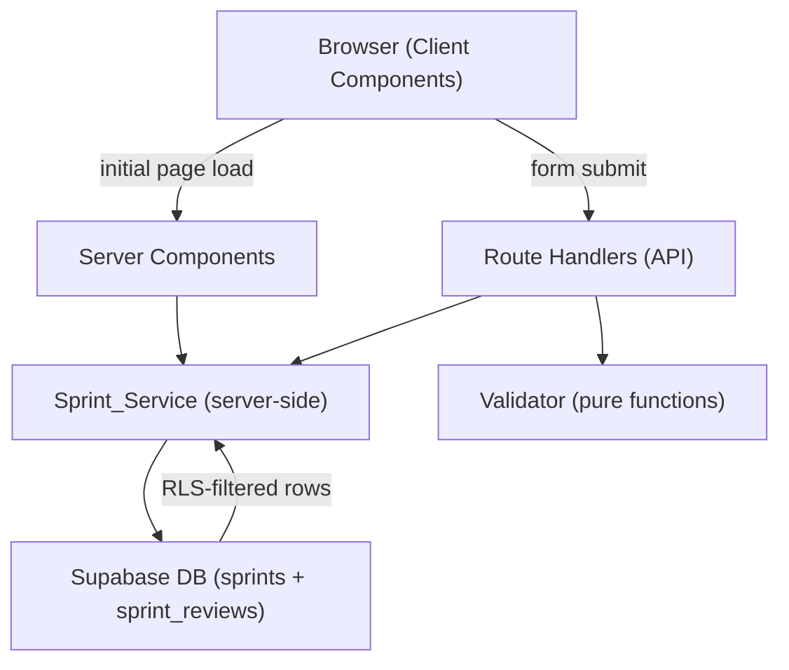

# Design Document: Sprint Dashboard & Review Management

## Overview

Sprint Dashboard & Review Management is the second feature in SprintSync's implementation order. It builds directly on the auth and team management foundation established by the User Account Management feature, reusing the same Supabase SSR client helpers, middleware, and RLS patterns.

The feature delivers three interconnected surfaces:

1. **Team Dashboard** (`/teams/[teamId]/dashboard`) — a Server Component page that lists the team's active sprint and all completed sprints.
2. **Sprint Detail** (`/teams/[teamId]/sprints/[sprintId]`) — a Server Component page that shows sprint metadata, the Sprint Review (if submitted), and the Review Form (when the sprint is still active).
3. **Sprint Creation** — a client-side form embedded in the dashboard that creates a new sprint via a Route Handler.

All data access is centralised in a new **Sprint_Service** layer (`lib/sprint/service.ts`), mirroring the Auth_Service pattern from the previous feature. Validation logic lives in a companion **Validator** (`lib/sprint/validators.ts`). Both are server-side only.

### Key Design Goals

- **Consistency with existing patterns**: Reuse `createServerClient` from `lib/supabase/server.ts`, the same middleware auth guard, and the same RLS-first approach established in User Account Management.
- **Server Components for data fetching**: Dashboard and Detail pages fetch data server-side; no client-side data fetching for initial renders.
- **Optimistic UI for mutations**: Sprint creation and review submission use Route Handlers; the client updates the UI via React state / router refresh rather than full page reloads.
- **Single active sprint invariant**: Enforced at both the validation layer and the database layer (unique partial index).
- **Upsert semantics for Sprint Reviews**: Submitting a review always upserts — no duplicate review records.

---

## Architecture

### High-Level Flow



### Next.js App Router Structure

```
app/
  teams/
    [teamId]/
      dashboard/
        page.tsx              ← Dashboard_Page (Server Component)
      sprints/
        [sprintId]/
          page.tsx            ← Sprint_Detail_Page (Server Component)
  api/
    teams/
      [teamId]/
        sprints/
          route.ts            ← POST /api/teams/[teamId]/sprints (create sprint)
          [sprintId]/
            reviews/
              route.ts        ← POST /api/teams/[teamId]/sprints/[sprintId]/reviews

lib/
  supabase/
    server.ts                 ← createServerClient (SSR) — reused from feature 1
    client.ts                 ← createBrowserClient — reused from feature 1
  sprint/
    service.ts                ← Sprint_Service — all sprint/review mutations & queries
    validators.ts             ← Validator — pure validation functions

components/
  sprint/
    SprintCard.tsx            ← Sprint card (Client Component, used in dashboard)
    SprintForm.tsx            ← Sprint_Form (Client Component)
    ReviewForm.tsx            ← Review_Form (Client Component)
    SprintDetail.tsx          ← Sprint detail display (Client Component)
    ActiveSprintSection.tsx   ← Active sprint section with empty state
    CompletedSprintsSection.tsx ← Completed sprints list with empty state

types/
  sprint.ts                   ← Sprint, SprintReview, SprintError TypeScript types
```

### Middleware

The existing `middleware.ts` from User Account Management already protects all routes under `(protected)/`. The `/teams/[teamId]/dashboard` and `/teams/[teamId]/sprints/[sprintId]` routes will be placed under the same protected layout, so no middleware changes are required.

---

## Components and Interfaces

### Sprint_Service (`lib/sprint/service.ts`)

All functions are server-side only and use the Supabase server client. The service enforces team scoping on every query — a user can only access sprints belonging to their own team.

```typescript
// Dashboard queries
getSprintsForTeam(teamId: string): Promise<Sprint[]>
getActiveSprint(teamId: string): Promise<Sprint | null>
getCompletedSprints(teamId: string): Promise<Sprint[]>

// Sprint detail
getSprintById(sprintId: string, teamId: string): Promise<Sprint | null>
getSprintReview(sprintId: string): Promise<SprintReview | null>

// Sprint creation
createSprint(teamId: string, data: CreateSprintData): Promise<SprintResult>

// Sprint Review submission (upsert)
upsertSprintReview(sprintId: string, data: UpsertReviewData): Promise<ReviewResult>

// Status transition (active → completed, triggered by review submission)
completeSprintWithReview(sprintId: string, reviewData: UpsertReviewData): Promise<ReviewResult>
```

```typescript
type CreateSprintData = {
  goal: string
  start_date: string   // ISO date string
  end_date: string     // ISO date string
  sprint_number: number
}

type UpsertReviewData = {
  increment_notes: string
  stakeholder_feedback: string | null
  accepted_stories_count: number
}

type SprintResult = { sprint: Sprint } | { error: SprintError }
type ReviewResult = { review: SprintReview; sprint: Sprint } | { error: SprintError }
```

#### `completeSprintWithReview` — Atomic Operation

This function performs two writes in a single Supabase transaction (using a Postgres function / RPC call) to ensure atomicity:
1. Upsert the `sprint_reviews` record.
2. Update the `sprints.status` from `active` to `completed`.

If either write fails, both are rolled back.

```sql
-- Supabase RPC function
CREATE OR REPLACE FUNCTION complete_sprint_with_review(
  p_sprint_id uuid,
  p_increment_notes text,
  p_stakeholder_feedback text,
  p_accepted_stories_count integer
) RETURNS void AS $$
BEGIN
  -- Validate status transition
  IF NOT EXISTS (
    SELECT 1 FROM sprints WHERE id = p_sprint_id AND status = 'active'
  ) THEN
    RAISE EXCEPTION 'SPRINT_NOT_ACTIVE';
  END IF;

  -- Upsert review
  INSERT INTO sprint_reviews (sprint_id, increment_notes, stakeholder_feedback, accepted_stories_count)
  VALUES (p_sprint_id, p_increment_notes, p_stakeholder_feedback, p_accepted_stories_count)
  ON CONFLICT (sprint_id) DO UPDATE
    SET increment_notes = EXCLUDED.increment_notes,
        stakeholder_feedback = EXCLUDED.stakeholder_feedback,
        accepted_stories_count = EXCLUDED.accepted_stories_count;

  -- Transition status
  UPDATE sprints SET status = 'completed' WHERE id = p_sprint_id;
END;
$$ LANGUAGE plpgsql SECURITY DEFINER;
```

### Validator (`lib/sprint/validators.ts`)

Pure functions — no side effects, no I/O.

```typescript
validateGoal(value: string): ValidationResult
validateStartDate(value: string): ValidationResult
validateEndDate(value: string, startDate: string): ValidationResult
validateSprintNumber(value: number): ValidationResult
validateIncrementNotes(value: string): ValidationResult
validateAcceptedStoriesCount(value: number): ValidationResult

type ValidationResult = { valid: true } | { valid: false; message: string }
```

### Route Handlers

#### `POST /api/teams/[teamId]/sprints`

1. Authenticate request (session from cookie via `createServerClient`).
2. Verify the authenticated user belongs to `teamId`.
3. Run Validator on request body.
4. Call `Sprint_Service.createSprint(teamId, data)`.
5. Return `{ data: Sprint }` on success or `{ error: SprintError }` on failure.

#### `POST /api/teams/[teamId]/sprints/[sprintId]/reviews`

1. Authenticate request.
2. Verify the authenticated user belongs to `teamId`.
3. Verify `sprintId` belongs to `teamId`.
4. Run Validator on request body.
5. Call `Sprint_Service.completeSprintWithReview(sprintId, data)`.
6. Return `{ data: { review, sprint } }` on success or `{ error: SprintError }` on failure.

### Page Components

| Page | Route | Type | Responsibility |
|---|---|---|---|
| Dashboard_Page | `/teams/[teamId]/dashboard` | Server Component | Fetches active + completed sprints server-side; renders ActiveSprintSection and CompletedSprintsSection |
| Sprint_Detail_Page | `/teams/[teamId]/sprints/[sprintId]` | Server Component | Fetches sprint + review server-side; renders SprintDetail and conditionally ReviewForm or read-only review |

### Client Components

| Component | Responsibility |
|---|---|
| `SprintCard` | Renders a single sprint's summary fields; navigates to Sprint_Detail_Page on click |
| `SprintForm` | Controlled form for sprint creation; calls POST sprint Route Handler; shows field-level errors |
| `ReviewForm` | Controlled form for review submission; calls POST review Route Handler; shows field-level errors |
| `ActiveSprintSection` | Renders the active sprint card or the empty-state prompt with CTA to open SprintForm |
| `CompletedSprintsSection` | Renders the completed sprints grid or empty-state message |
| `SprintDetail` | Renders sprint metadata fields |

---

## Data Models

### `sprints` Table

```sql
CREATE TABLE sprints (
  id             uuid PRIMARY KEY DEFAULT gen_random_uuid(),
  team_id        uuid NOT NULL REFERENCES teams(id) ON DELETE CASCADE,
  sprint_number  integer NOT NULL,
  goal           text NOT NULL,
  status         text NOT NULL DEFAULT 'active' CHECK (status IN ('active', 'completed')),
  start_date     date NOT NULL,
  end_date       date NOT NULL,
  created_at     timestamptz NOT NULL DEFAULT now(),

  CONSTRAINT sprints_end_after_start CHECK (end_date > start_date),
  CONSTRAINT sprints_sprint_number_positive CHECK (sprint_number > 0),
  UNIQUE (team_id, sprint_number)
);

-- Enforce at most one active sprint per team at the database level
CREATE UNIQUE INDEX sprints_one_active_per_team
  ON sprints (team_id)
  WHERE status = 'active';
```

### `sprint_reviews` Table

```sql
CREATE TABLE sprint_reviews (
  id                     uuid PRIMARY KEY DEFAULT gen_random_uuid(),
  sprint_id              uuid NOT NULL REFERENCES sprints(id) ON DELETE CASCADE,
  increment_notes        text NOT NULL,
  stakeholder_feedback   text,
  accepted_stories_count integer NOT NULL CHECK (accepted_stories_count >= 0),
  created_at             timestamptz NOT NULL DEFAULT now(),

  UNIQUE (sprint_id)   -- one review per sprint
);
```

### RLS Policies

Team membership is determined by the `team_members` table (established in feature 1). All RLS policies scope access to the authenticated user's teams.

```sql
-- Enable RLS
ALTER TABLE sprints ENABLE ROW LEVEL SECURITY;
ALTER TABLE sprint_reviews ENABLE ROW LEVEL SECURITY;

-- sprints: team members can read sprints for their teams
CREATE POLICY "sprints_select_team_member"
  ON sprints FOR SELECT
  USING (
    team_id IN (
      SELECT team_id FROM team_members WHERE user_id = auth.uid()
    )
  );

-- sprints: team members can insert sprints for their teams
CREATE POLICY "sprints_insert_team_member"
  ON sprints FOR INSERT
  WITH CHECK (
    team_id IN (
      SELECT team_id FROM team_members WHERE user_id = auth.uid()
    )
  );

-- sprints: team members can update sprints for their teams
CREATE POLICY "sprints_update_team_member"
  ON sprints FOR UPDATE
  USING (
    team_id IN (
      SELECT team_id FROM team_members WHERE user_id = auth.uid()
    )
  )
  WITH CHECK (
    team_id IN (
      SELECT team_id FROM team_members WHERE user_id = auth.uid()
    )
  );

-- sprint_reviews: team members can read reviews for their team's sprints
CREATE POLICY "sprint_reviews_select_team_member"
  ON sprint_reviews FOR SELECT
  USING (
    sprint_id IN (
      SELECT s.id FROM sprints s
      JOIN team_members tm ON tm.team_id = s.team_id
      WHERE tm.user_id = auth.uid()
    )
  );

-- sprint_reviews: team members can insert/update reviews for their team's sprints
CREATE POLICY "sprint_reviews_insert_team_member"
  ON sprint_reviews FOR INSERT
  WITH CHECK (
    sprint_id IN (
      SELECT s.id FROM sprints s
      JOIN team_members tm ON tm.team_id = s.team_id
      WHERE tm.user_id = auth.uid()
    )
  );

CREATE POLICY "sprint_reviews_update_team_member"
  ON sprint_reviews FOR UPDATE
  USING (
    sprint_id IN (
      SELECT s.id FROM sprints s
      JOIN team_members tm ON tm.team_id = s.team_id
      WHERE tm.user_id = auth.uid()
    )
  );
```

### TypeScript Types (`types/sprint.ts`)

```typescript
export type SprintStatus = 'active' | 'completed'

export interface Sprint {
  id: string
  team_id: string
  sprint_number: number
  goal: string
  status: SprintStatus
  start_date: string   // ISO date string (YYYY-MM-DD)
  end_date: string     // ISO date string (YYYY-MM-DD)
  created_at: string
}

export interface SprintReview {
  id: string
  sprint_id: string
  increment_notes: string
  stakeholder_feedback: string | null
  accepted_stories_count: number
  created_at: string
}

export interface SprintError {
  code: SprintErrorCode
  message: string
  field?: 'goal' | 'start_date' | 'end_date' | 'sprint_number' | 'increment_notes' | 'accepted_stories_count'
}

export type SprintErrorCode =
  | 'GOAL_REQUIRED'
  | 'START_DATE_REQUIRED'
  | 'END_DATE_REQUIRED'
  | 'END_DATE_NOT_AFTER_START'
  | 'SPRINT_NUMBER_INVALID'
  | 'SPRINT_NUMBER_DUPLICATE'
  | 'ACTIVE_SPRINT_EXISTS'
  | 'SPRINT_NOT_FOUND'
  | 'SPRINT_NOT_ACTIVE'
  | 'INVALID_STATUS_TRANSITION'
  | 'INCREMENT_NOTES_REQUIRED'
  | 'ACCEPTED_STORIES_INVALID'
  | 'UNAUTHORIZED'
  | 'FORBIDDEN'
  | 'UNKNOWN'
```

---

## Correctness Properties

*A property is a characteristic or behavior that should hold true across all valid executions of a system — essentially, a formal statement about what the system should do. Properties serve as the bridge between human-readable specifications and machine-verifiable correctness guarantees.*

### Property 1: Completed sprints are ordered by sprint_number descending

*For any* set of completed sprints belonging to a team, `getCompletedSprints` must return them ordered by `sprint_number` in descending order — the highest sprint number appears first.

**Validates: Requirements 1.2**

---

### Property 2: Sprint data display contains all required fields

*For any* Sprint object, the rendered sprint card or sprint detail component must contain the sprint's `sprint_number`, `goal`, `status`, `start_date`, and `end_date` values.

**Validates: Requirements 1.5, 3.1**

---

### Property 3: Sprint review data display contains all required fields

*For any* SprintReview object, the rendered read-only review display must contain the review's `increment_notes`, `stakeholder_feedback`, and `accepted_stories_count` values.

**Validates: Requirements 3.2**

---

### Property 4: Sprint creation round-trip preserves all provided fields

*For any* valid `CreateSprintData` (goal, start_date, end_date, sprint_number), a successful `createSprint` call must persist a Sprint record whose `goal`, `start_date`, `end_date`, and `sprint_number` exactly match the provided values, and whose `status` is `'active'`.

**Validates: Requirements 2.1**

---

### Property 5: Validators reject all empty and whitespace-only inputs

*For any* string composed entirely of whitespace characters (including the empty string), `validateGoal` and `validateIncrementNotes` must return `valid: false` with a non-empty message.

**Validates: Requirements 2.2, 4.3**

---

### Property 6: End date must be strictly after start date

*For any* pair of date strings where `end_date` is not strictly after `start_date` (i.e., `end_date <= start_date`), `validateEndDate` must return `valid: false`. *For any* pair where `end_date` is strictly after `start_date`, `validateEndDate` must return `valid: true`.

**Validates: Requirements 2.3**

---

### Property 7: Sprint number must be a positive integer

*For any* value that is not a positive integer (zero, negative numbers, non-integers, NaN), `validateSprintNumber` must return `valid: false`. *For any* positive integer value, `validateSprintNumber` must return `valid: true`.

**Validates: Requirements 2.4**

---

### Property 8: Active sprint uniqueness invariant

*For any* team that already has an active sprint, any call to `createSprint` for that team must return a `SprintError` with code `'ACTIVE_SPRINT_EXISTS'` — the new sprint must not be persisted.

**Validates: Requirements 2.5**

---

### Property 9: Cross-team sprint access returns null

*For any* `sprintId` that belongs to a team other than the authenticated user's team, `getSprintById` must return `null`, causing the Sprint_Detail_Page to return a 404 response.

**Validates: Requirements 3.5**

---

### Property 10: Review submission round-trip preserves all provided fields

*For any* valid `UpsertReviewData` (increment_notes, stakeholder_feedback, accepted_stories_count) submitted for an active sprint, a successful `completeSprintWithReview` call must persist a SprintReview record whose fields exactly match the provided values, linked to the correct `sprint_id`.

**Validates: Requirements 4.1**

---

### Property 11: Review submission transitions sprint status to completed

*For any* active sprint, after a successful `completeSprintWithReview` call, the sprint's `status` must be `'completed'`.

**Validates: Requirements 4.2**

---

### Property 12: Accepted stories count must be a non-negative integer

*For any* value that is negative or not an integer, `validateAcceptedStoriesCount` must return `valid: false`. *For any* non-negative integer value (including zero), `validateAcceptedStoriesCount` must return `valid: true`.

**Validates: Requirements 4.4**

---

### Property 13: Review upsert is idempotent

*For any* sprint, calling `completeSprintWithReview` multiple times with different review data must result in exactly one `sprint_reviews` record — the most recent call's data is stored, and no duplicate records are created.

**Validates: Requirements 4.5**

---

### Property 14: Only active-to-completed status transition is permitted

*For any* sprint in `'completed'` status, any attempt to transition its status (including back to `'active'`) must be rejected by the Sprint_Service with a `SprintError` code of `'INVALID_STATUS_TRANSITION'`.

**Validates: Requirements 5.1, 5.2**

---

## Error Handling

### Error Classification

| Category | Examples | Handling |
|---|---|---|
| Validation errors | Empty goal, end_date before start_date, negative accepted_stories_count | Field-level error message inline beneath the relevant input; form retains entered data |
| Business rule errors | Active sprint already exists, sprint not active for review | Form-level error message; form retains entered data |
| Not found errors | sprintId not belonging to user's team | 404 response from Server Component via `notFound()` |
| Authorization errors | Unauthenticated access to dashboard or detail page | Redirect to `/auth` via middleware |
| Status transition errors | Attempting to reactivate a completed sprint | `INVALID_STATUS_TRANSITION` error returned from Sprint_Service |
| Network / service errors | Supabase unreachable, RPC failure | Toast notification with retry suggestion; form retains data |

### Error Message Strategy

- **Field-level errors**: Displayed inline beneath the relevant input, associated via `aria-describedby` for accessibility. Cleared when the user modifies the relevant field.
- **Active sprint conflict**: Display "Your team already has an active sprint. Complete it before creating a new one." at the form level.
- **Sprint not found / wrong team**: Server Component calls `notFound()` to return a 404 — no information leakage about whether the sprint exists for another team.
- **Unexpected errors** (code `UNKNOWN`): Display "Something went wrong. Please try again." — never expose raw Supabase error messages to the client.

### Route Handler Error Responses

```typescript
// Success
{ data: T }

// Error
{ error: { code: SprintErrorCode; message: string; field?: string } }
```

HTTP status codes:
- `400` — validation failure or business rule violation
- `401` — unauthenticated
- `403` — authenticated but not a member of the target team
- `404` — sprint not found or not belonging to user's team
- `409` — conflict (active sprint already exists, duplicate sprint_number)
- `500` — unexpected server error

---

## Testing Strategy

### Unit Tests (Vitest)

Focus on the Validator pure functions and Sprint_Service logic with mocked Supabase clients:

- **Validator**: Test each validation function with representative valid inputs, invalid inputs, and boundary values (e.g., `end_date` equal to `start_date`, `sprint_number = 0`, `accepted_stories_count = -1`, whitespace-only goal).
- **Sprint_Service**: Test error mapping from Supabase/RPC error codes to `SprintErrorCode` values using mocked Supabase clients. Test that `completeSprintWithReview` calls the RPC function with correct arguments.
- **Ordering**: Test that `getCompletedSprints` applies the correct `order` clause.

### Property-Based Tests (fast-check)

Use [fast-check](https://github.com/dubzzz/fast-check) for Validator functions and Sprint_Service logic. Each property test runs a minimum of 100 iterations.

**Property 1 — Completed sprints are ordered by sprint_number descending**
Tag: `Feature: sprint-dashboard-review, Property 1: Completed sprints are ordered by sprint_number descending`
Generate: arrays of Sprint objects with random sprint_numbers and status='completed'; assert the result of `getCompletedSprints` (mocked DB) is sorted by sprint_number descending.

**Property 2 — Sprint data display contains all required fields**
Tag: `Feature: sprint-dashboard-review, Property 2: Sprint data display contains all required fields`
Generate: random Sprint objects with varying field values; assert the rendered SprintCard and SprintDetail output strings contain sprint_number, goal, status, start_date, and end_date.

**Property 3 — Sprint review data display contains all required fields**
Tag: `Feature: sprint-dashboard-review, Property 3: Sprint review data display contains all required fields`
Generate: random SprintReview objects; assert the rendered read-only review display contains increment_notes, stakeholder_feedback (when non-null), and accepted_stories_count.

**Property 4 — Sprint creation round-trip preserves all provided fields**
Tag: `Feature: sprint-dashboard-review, Property 4: Sprint creation round-trip preserves all provided fields`
Generate: valid CreateSprintData (non-empty goal, valid date pairs, positive sprint_number); assert createSprint (mocked Supabase) persists a record with matching fields and status='active'.

**Property 5 — Validators reject all empty and whitespace-only inputs**
Tag: `Feature: sprint-dashboard-review, Property 5: Validators reject all empty and whitespace-only inputs`
Generate: strings composed entirely of whitespace characters (spaces, tabs, newlines) and the empty string; assert validateGoal and validateIncrementNotes return `valid: false` with non-empty message.

**Property 6 — End date must be strictly after start date**
Tag: `Feature: sprint-dashboard-review, Property 6: End date must be strictly after start date`
Generate: date pairs where end_date <= start_date (same date, end before start); assert validateEndDate returns `valid: false`. Generate date pairs where end_date > start_date; assert `valid: true`.

**Property 7 — Sprint number must be a positive integer**
Tag: `Feature: sprint-dashboard-review, Property 7: Sprint number must be a positive integer`
Generate: zero, negative integers, floats, NaN; assert validateSprintNumber returns `valid: false`. Generate positive integers; assert `valid: true`.

**Property 8 — Active sprint uniqueness invariant**
Tag: `Feature: sprint-dashboard-review, Property 8: Active sprint uniqueness invariant`
Generate: team states with an existing active sprint; assert createSprint (mocked Supabase returning conflict) returns error with code 'ACTIVE_SPRINT_EXISTS'.

**Property 9 — Cross-team sprint access returns null**
Tag: `Feature: sprint-dashboard-review, Property 9: Cross-team sprint access returns null`
Generate: sprintId/teamId pairs where the sprint belongs to a different team (mocked DB returns no rows due to RLS); assert getSprintById returns null.

**Property 10 — Review submission round-trip preserves all provided fields**
Tag: `Feature: sprint-dashboard-review, Property 10: Review submission round-trip preserves all provided fields`
Generate: valid UpsertReviewData (non-empty increment_notes, non-negative accepted_stories_count, optional stakeholder_feedback); assert completeSprintWithReview (mocked RPC) is called with matching field values.

**Property 11 — Review submission transitions sprint status to completed**
Tag: `Feature: sprint-dashboard-review, Property 11: Review submission transitions sprint status to completed`
Generate: active sprint scenarios; assert that after completeSprintWithReview, the sprint returned has status='completed'.

**Property 12 — Accepted stories count must be a non-negative integer**
Tag: `Feature: sprint-dashboard-review, Property 12: Accepted stories count must be a non-negative integer`
Generate: negative integers and non-integers (floats, NaN); assert validateAcceptedStoriesCount returns `valid: false`. Generate non-negative integers (including 0); assert `valid: true`.

**Property 13 — Review upsert is idempotent**
Tag: `Feature: sprint-dashboard-review, Property 13: Review upsert is idempotent`
Generate: sprint scenarios with varying review data; assert that calling completeSprintWithReview multiple times results in exactly one sprint_reviews record (ON CONFLICT DO UPDATE semantics verified via mocked Supabase upsert call count).

**Property 14 — Only active-to-completed status transition is permitted**
Tag: `Feature: sprint-dashboard-review, Property 14: Only active-to-completed status transition is permitted`
Generate: completed sprint scenarios; assert that any attempt to call completeSprintWithReview on a completed sprint returns error with code 'SPRINT_NOT_ACTIVE' or 'INVALID_STATUS_TRANSITION'.

### Integration Tests

- **Sprint creation flow**: POST to `/api/teams/[teamId]/sprints` with valid data; verify sprint record is created in DB with correct fields and status='active'.
- **Active sprint conflict**: POST sprint creation when team already has an active sprint; verify 409 response and no new record created.
- **Review submission flow**: POST to `/api/teams/[teamId]/sprints/[sprintId]/reviews`; verify sprint_reviews record is upserted and sprint status transitions to 'completed'.
- **Review upsert**: Submit review twice for the same sprint; verify only one sprint_reviews record exists with the latest data.
- **RLS enforcement (sprints)**: Attempt to read/write sprints for a team the user doesn't belong to; verify access is denied.
- **RLS enforcement (sprint_reviews)**: Attempt to read/write sprint_reviews for another team's sprints; verify access is denied.
- **Cross-team 404**: Navigate to a sprintId belonging to another team; verify 404 response.
- **Dashboard data scoping**: Verify getSprintsForTeam only returns sprints for the specified teamId.

### Smoke Tests

- `sprints` table exists with correct schema, constraints, and RLS policies.
- `sprint_reviews` table exists with correct schema, constraints, and RLS policies.
- `complete_sprint_with_review` RPC function exists in Supabase.
- Partial unique index `sprints_one_active_per_team` exists.
- Unauthenticated requests to `/teams/[teamId]/dashboard` are redirected to `/auth` by middleware.
