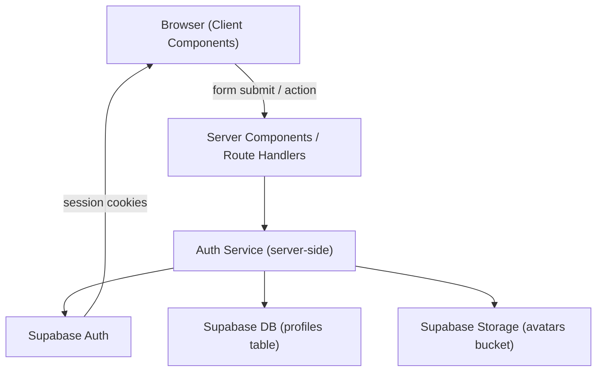

# Design Document: User Account Management

## Overview

User Account Management is the foundational feature of SprintSync. It provides registration, authentication, profile management, password operations, and account deletion for Esoft team members. Every other feature in SprintSync depends on the authenticated identity established here.

The feature is built on **Supabase Auth** (email/password + optional Google SSO) with a custom `profiles` table that extends the auth identity with display name and avatar. All server-side auth operations use the `@supabase/ssr` package to ensure session cookies are correctly managed in the Next.js App Router environment.

### Key Design Goals

- **Security by default**: RLS on all tables, server-side session validation on every protected request, no secrets in client state.
- **Seamless session persistence**: Supabase SSR handles token refresh transparently; users are never interrupted mid-session.
- **Progressive enhancement**: Forms work without JavaScript for basic validation; client-side enhancements (loading states, toast notifications) layer on top.
- **Minimal surface area**: Auth logic is centralised in a single `Auth_Service` layer; pages and components are thin consumers.

---

## Architecture

### High-Level Flow



### Next.js App Router Structure

```
app/
  auth/
    page.tsx                  ← Auth_Page (login + register toggle)
    reset-password/
      page.tsx                ← Password reset request form
    confirm/
      page.tsx                ← Password reset completion form (handles Supabase callback)
  account/
    profile/
      page.tsx                ← Profile_Page (Server Component wrapper)
    settings/
      page.tsx                ← Account_Settings_Page (Server Component wrapper)
  (protected)/
    layout.tsx                ← Middleware-enforced auth guard

middleware.ts                 ← Session refresh + route protection

lib/
  supabase/
    server.ts                 ← createServerClient (SSR)
    client.ts                 ← createBrowserClient
  auth/
    service.ts                ← Auth_Service — all auth mutations
    validators.ts             ← Validator — shared validation logic

components/
  auth/
    LoginForm.tsx             ← Login_Form (Client Component)
    RegisterForm.tsx          ← Register_Form (Client Component)
    GoogleSSOButton.tsx       ← Google SSO trigger (Client Component)
  account/
    ProfileForm.tsx           ← Profile edit form (Client Component)
    AvatarUpload.tsx          ← Avatar upload control (Client Component)
    PasswordChangeForm.tsx    ← Password change form (Client Component)
    DeleteAccountDialog.tsx   ← Confirmation dialog (Client Component)
  shared/
    NavHeader.tsx             ← Navigation header with logout control
```

### Middleware

`middleware.ts` runs on every request to:
1. Refresh the Supabase session (exchange refresh token for new access token if needed).
2. Redirect unauthenticated users away from protected routes to `/auth?redirect=<original_url>`.
3. Redirect authenticated users away from `/auth` to `/teams`.

---

## Components and Interfaces

### Auth_Service (`lib/auth/service.ts`)

All functions are server-side only and use the Supabase server client.

```typescript
// Registration
registerWithEmail(email: string, password: string, displayName: string): Promise<AuthResult>

// Login
loginWithEmail(email: string, password: string): Promise<AuthResult>

// Google SSO
initiateGoogleSSO(): Promise<{ url: string }>

// Session
logout(): Promise<void>

// Profile
getProfile(userId: string): Promise<Profile>
updateProfile(userId: string, data: ProfileUpdateData): Promise<Profile>
uploadAvatar(userId: string, file: File): Promise<string>  // returns avatar_url

// Password
changePassword(userId: string, currentPassword: string, newPassword: string): Promise<void>
requestPasswordReset(email: string): Promise<void>
completePasswordReset(newPassword: string): Promise<void>

// Account deletion
deleteAccount(userId: string): Promise<void>
```

```typescript
type AuthResult = { user: User; session: Session } | { error: AuthError }

type Profile = {
  id: string
  display_name: string
  avatar_url: string | null
  created_at: string
}

type ProfileUpdateData = {
  display_name?: string
  avatar_url?: string
}

type AuthError = {
  code: AuthErrorCode
  message: string
  field?: 'email' | 'password' | 'display_name' | 'current_password' | 'new_password' | 'confirm_new_password'
}

type AuthErrorCode =
  | 'EMAIL_ALREADY_EXISTS'
  | 'INVALID_CREDENTIALS'
  | 'WEAK_PASSWORD'
  | 'INVALID_EMAIL'
  | 'DISPLAY_NAME_INVALID'
  | 'WRONG_CURRENT_PASSWORD'
  | 'PASSWORD_MISMATCH'
  | 'AVATAR_TOO_LARGE'
  | 'AVATAR_INVALID_FORMAT'
  | 'RESET_LINK_EXPIRED'
  | 'UNAUTHORIZED'
  | 'FORBIDDEN'
  | 'UNKNOWN'
```

### Validator (`lib/auth/validators.ts`)

Pure functions — no side effects, no I/O.

```typescript
validateEmail(value: string): ValidationResult
validatePassword(value: string): ValidationResult
validateDisplayName(value: string): ValidationResult
validateAvatarFile(file: File): ValidationResult
validatePasswordsMatch(password: string, confirm: string): ValidationResult

type ValidationResult = { valid: true } | { valid: false; message: string }
```

### Page Components

| Page | Route | Type | Responsibility |
|---|---|---|---|
| Auth_Page | `/auth` | Client Component | Hosts login/register toggle, Google SSO button |
| Reset Password Page | `/auth/reset-password` | Client Component | Password reset request form |
| Confirm Page | `/auth/confirm` | Server Component | Handles Supabase auth callback, redirects |
| Profile_Page | `/account/profile` | Server Component (wrapper) | Fetches profile server-side, renders ProfileForm |
| Account_Settings_Page | `/account/settings` | Server Component (wrapper) | Fetches user metadata, renders password/delete forms |

### NavHeader

Rendered in the root authenticated layout. Displays the user's avatar and display name, and provides a logout button that calls the Auth_Service logout action.

---

## Data Models

### Supabase Auth (`auth.users`)

Managed entirely by Supabase Auth. SprintSync does not write directly to this table.

| Column | Type | Notes |
|---|---|---|
| id | uuid | Primary key, referenced by `profiles.id` |
| email | text | Unique, used for login |
| created_at | timestamptz | Auto-set |

### `profiles` Table

```sql
CREATE TABLE profiles (
  id          uuid PRIMARY KEY REFERENCES auth.users(id) ON DELETE CASCADE,
  display_name text NOT NULL CHECK (char_length(display_name) BETWEEN 1 AND 50),
  avatar_url  text,
  created_at  timestamptz NOT NULL DEFAULT now()
);
```

**RLS Policies:**

```sql
-- Users can read only their own profile
CREATE POLICY "profiles_select_own"
  ON profiles FOR SELECT
  USING (auth.uid() = id);

-- Users can update only their own display_name and avatar_url
CREATE POLICY "profiles_update_own"
  ON profiles FOR UPDATE
  USING (auth.uid() = id)
  WITH CHECK (auth.uid() = id);

-- Service role can insert (used during registration)
CREATE POLICY "profiles_insert_service"
  ON profiles FOR INSERT
  WITH CHECK (auth.uid() = id);
```

### Supabase Storage — `avatars` Bucket

```sql
-- Only the owning user may upload/replace their avatar
CREATE POLICY "avatars_upload_own"
  ON storage.objects FOR INSERT
  WITH CHECK (
    bucket_id = 'avatars' AND
    auth.uid()::text = (storage.foldername(name))[1]
  );

CREATE POLICY "avatars_update_own"
  ON storage.objects FOR UPDATE
  USING (
    bucket_id = 'avatars' AND
    auth.uid()::text = (storage.foldername(name))[1]
  );

-- Public read for avatar display
CREATE POLICY "avatars_public_read"
  ON storage.objects FOR SELECT
  USING (bucket_id = 'avatars');
```

Avatar files are stored at path `{userId}/{filename}` within the `avatars` bucket.

### Account Deletion Cascade

When a user is deleted:
- `profiles` record is deleted via `ON DELETE CASCADE` on the foreign key.
- `RetroCard.author_id` is set to `null` (FK defined as `ON DELETE SET NULL`).
- `ActionItem.assignee_id` is set to `null` (FK defined as `ON DELETE SET NULL`).

These cascade behaviours must be defined on the `retro_cards` and `action_items` tables respectively.

### TypeScript Types (`types/auth.ts`)

```typescript
export interface Profile {
  id: string
  display_name: string
  avatar_url: string | null
  created_at: string
}

export interface UserWithProfile {
  id: string
  email: string
  profile: Profile
  provider: 'email' | 'google'
}
```

---

## Correctness Properties

*A property is a characteristic or behavior that should hold true across all valid executions of a system — essentially, a formal statement about what the system should do. Properties serve as the bridge between human-readable specifications and machine-verifiable correctness guarantees.*

### Property 1: Valid registration creates a profile

*For any* valid combination of email, password, and display name, a successful registration call must result in a `profiles` record existing for the new user with the exact display name provided.

**Validates: Requirements 1.2**

---

### Property 2: Validator rejects all invalid inputs

*For any* input value that violates a validation rule — including empty email, malformed email (no `@`, no domain), password shorter than 8 characters, password missing an uppercase letter, password missing a lowercase letter, password missing a digit, display name that is empty, or display name exceeding 50 characters — the corresponding Validator function must return `valid: false` with a non-empty message. This rule applies uniformly across all call contexts (registration, login, profile update, password change, password reset).

**Validates: Requirements 1.3, 1.4, 1.5, 2.4, 5.3, 6.4, 7.3**

---

### Property 3: Validator accepts all conforming inputs

*For any* email string in valid format, any password string of at least 8 characters containing at least one uppercase letter, one lowercase letter, and one digit, and any display name string of 1–50 characters, the corresponding Validator function must return `valid: true`. This rule applies uniformly across all call contexts.

**Validates: Requirements 1.3, 1.4, 1.5**

---

### Property 4: Passwords-match validation is commutative in failure

*For any* two distinct strings `a` and `b`, `validatePasswordsMatch(a, b)` and `validatePasswordsMatch(b, a)` must both return `valid: false` — order does not affect the failure outcome.

**Validates: Requirements 6.5, 7.7**

---

### Property 5: Display name sanitisation removes all HTML markup

*For any* display name string containing HTML markup (tags, attributes, or entities), the sanitised value stored in the database must contain no `<` or `>` characters — the stored value must be plain text only.

**Validates: Requirements 9.7**

---

### Property 6: Avatar file validation correctly classifies files

*For any* file that exceeds 2 MB in size or whose MIME type is not `image/jpeg`, `image/png`, or `image/webp`, `validateAvatarFile` must return `valid: false`. *For any* file that is at most 2 MB in size and whose MIME type is one of those three types, `validateAvatarFile` must return `valid: true`.

**Validates: Requirements 5.5**

---

### Property 7: Google SSO never creates duplicate profiles

*For any* existing user who authenticates via Google SSO, the number of `profiles` records associated with that user's ID must remain exactly 1 after any number of SSO login completions.

**Validates: Requirements 3.4**

---

### Property 8: Password reset confirmation is always shown

*For any* email string submitted to the password reset request form — whether or not it corresponds to an existing account — the application must display the confirmation message instructing the user to check their email.

**Validates: Requirements 7.4**

---

### Property 9: Unauthenticated requests to protected endpoints return 401

*For any* Route Handler that performs a protected mutation, any request made without a valid session must receive a 401 HTTP response.

**Validates: Requirements 9.4**

---

### Property 10: Cross-user profile mutations are rejected with 403

*For any* profile mutation request where the target `profiles` record ID does not match the authenticated user's ID, the Auth_Service must reject the request and return a 403 response.

**Validates: Requirements 9.5**

---

### Property 11: Account deletion nullifies personal attribution

*For any* user with any number of authored RetroCards and assigned ActionItems, after that user's account is deleted, all of their RetroCards must have `author_id = null` and all of their ActionItems must have `assignee_id = null`.

**Validates: Requirements 8.4, 8.5**

---

### Property 12: Email confirmation mismatch blocks account deletion

*For any* string entered in the deletion confirmation dialog that is not an exact match for the authenticated user's email address, the deletion must not proceed and a field-level error must be displayed.

**Validates: Requirements 8.8**

---

### Property 13: Toast notifications are shown for all significant actions

*For any* successful completion of a significant user action (registration, login, profile update, password change, logout), the application must trigger a toast notification confirming the action.

**Validates: Requirements 10.3**

---

## Error Handling

### Error Classification

| Category | Examples | Handling |
|---|---|---|
| Validation errors | Empty field, malformed email, weak password | Field-level error message; form retains entered data (except password fields) |
| Auth errors | Invalid credentials, email already exists | Form-level or field-level error; generic message for credential failures to avoid enumeration |
| Network / service errors | Supabase unreachable, timeout | Toast notification with retry suggestion; form retains data |
| Authorization errors | Accessing another user's profile | 401/403 HTTP response from Route Handler; redirect to auth page |
| Reset link errors | Expired or invalid token | Descriptive error page with link to request a new reset email |

### Error Message Strategy

- **Credential failures** (login, password change): Always display "Invalid email or password" — never indicate which field is wrong to prevent user enumeration.
- **Email already exists** (registration): Display a generic message such as "An account with this email already exists" — do not confirm whether the email is registered.
- **Password reset request**: Always display the confirmation message regardless of whether the email exists — prevents email enumeration.
- **Field-level errors**: Displayed inline beneath the relevant input, associated via `aria-describedby` for accessibility.

### Server-Side Error Boundaries

Route Handlers return structured JSON errors:

```typescript
// Success
{ data: T }

// Error
{ error: { code: AuthErrorCode; message: string; field?: string } }
```

HTTP status codes:
- `400` — validation failure
- `401` — unauthenticated
- `403` — authenticated but forbidden (wrong user)
- `409` — conflict (email already exists)
- `500` — unexpected server error

### Client-Side Error Handling

- Forms catch errors from Server Actions / Route Handler responses and map `AuthErrorCode` values to user-facing messages.
- Unexpected errors (code `UNKNOWN`) display a generic "Something went wrong. Please try again." message.
- All error states are cleared when the user modifies the relevant input field.

---

## Testing Strategy

### Unit Tests (Vitest)

Focus on the Validator and Auth_Service pure logic:

- **Validator**: Test each validation function with representative valid inputs, invalid inputs, and boundary values (e.g., exactly 50 characters for display name, exactly 8 characters for password).
- **Auth_Service**: Test error mapping from Supabase error codes to `AuthErrorCode` values using mocked Supabase clients.
- **Sanitisation**: Test that HTML markup in display names is stripped before persistence.

### Property-Based Tests (fast-check)

Use [fast-check](https://github.com/dubzzz/fast-check) for the Validator functions and Auth_Service logic. Each property test runs a minimum of 100 iterations.

**Property 1 — Valid registration creates a profile**
Tag: `Feature: user-account-management, Property 1: Valid registration creates a profile`
Generate: valid email + password + display name combinations; assert profile record exists with correct display name after registration (using mocked Supabase client).

**Property 2 — Validator rejects all invalid inputs**
Tag: `Feature: user-account-management, Property 2: Validator rejects all invalid inputs`
Generate: strings that violate each rule (empty email, malformed email, passwords < 8 chars, passwords missing uppercase/lowercase/digit, empty display names, display names > 50 chars); assert `validateEmail`, `validatePassword`, `validateDisplayName` return `valid: false` with non-empty message.

**Property 3 — Validator accepts all conforming inputs**
Tag: `Feature: user-account-management, Property 3: Validator accepts all conforming inputs`
Generate: conforming email strings, passwords meeting all criteria, display names of 1–50 characters; assert all validators return `valid: true`.

**Property 4 — Passwords-match validation is commutative in failure**
Tag: `Feature: user-account-management, Property 4: Passwords-match validation is commutative in failure`
Generate: pairs of distinct strings; assert `validatePasswordsMatch(a, b)` and `validatePasswordsMatch(b, a)` both return `valid: false`.

**Property 5 — Display name sanitisation removes all HTML markup**
Tag: `Feature: user-account-management, Property 5: Display name sanitisation removes all HTML markup`
Generate: strings containing arbitrary HTML tags; assert sanitised output contains no `<` or `>` characters.

**Property 6 — Avatar file validation correctly classifies files**
Tag: `Feature: user-account-management, Property 6: Avatar file validation correctly classifies files`
Generate: mock File objects with varying sizes and MIME types; assert `validateAvatarFile` returns `valid: false` for oversized or wrong-format files, and `valid: true` for conforming files.

**Property 7 — Google SSO never creates duplicate profiles**
Tag: `Feature: user-account-management, Property 7: Google SSO never creates duplicate profiles`
Generate: existing user scenarios; assert profiles count remains 1 after repeated SSO logins (mocked Supabase).

**Property 8 — Password reset confirmation is always shown**
Tag: `Feature: user-account-management, Property 8: Password reset confirmation is always shown`
Generate: arbitrary email strings (valid and invalid); assert confirmation message is always displayed after submission.

**Property 9 — Unauthenticated requests to protected endpoints return 401**
Tag: `Feature: user-account-management, Property 9: Unauthenticated requests to protected endpoints return 401`
Generate: various protected Route Handler calls without auth; assert all return 401.

**Property 10 — Cross-user profile mutations are rejected with 403**
Tag: `Feature: user-account-management, Property 10: Cross-user profile mutations are rejected with 403`
Generate: profile mutation requests with mismatched user IDs; assert 403 response.

**Property 11 — Account deletion nullifies personal attribution**
Tag: `Feature: user-account-management, Property 11: Account deletion nullifies personal attribution`
Generate: users with varying numbers of RetroCards and ActionItems; assert all author_id and assignee_id values are null after deletion (mocked DB).

**Property 12 — Email confirmation mismatch blocks account deletion**
Tag: `Feature: user-account-management, Property 12: Email confirmation mismatch blocks account deletion`
Generate: strings that are not equal to the user's email; assert deletion is blocked with field-level error.

**Property 13 — Toast notifications are shown for all significant actions**
Tag: `Feature: user-account-management, Property 13: Toast notifications are shown for all significant actions`
Generate: each action type (registration, login, profile update, password change, logout); assert toast notification is triggered after successful completion.

### Integration Tests

- **Registration flow**: Register a user via the Route Handler, verify `profiles` record is created, verify session cookie is set.
- **Login flow**: Login with valid credentials, verify session; login with invalid credentials, verify 401 and generic error message.
- **Google SSO callback**: Simulate Supabase OAuth callback, verify profile creation for new users and no duplicate for existing users.
- **Session refresh**: Simulate expired access token, verify middleware refreshes session transparently.
- **Account deletion cascade**: Delete a user, verify `profiles` is removed, `RetroCard.author_id` is null, `ActionItem.assignee_id` is null.
- **RLS enforcement**: Attempt to read/update another user's profile using a different user's session, verify 403.

### Smoke Tests

- Supabase project is reachable and Auth is enabled.
- Google OAuth provider is configured (or gracefully absent — button hidden).
- `avatars` storage bucket exists with correct RLS policies.
- `profiles` table exists with correct schema and RLS policies.
